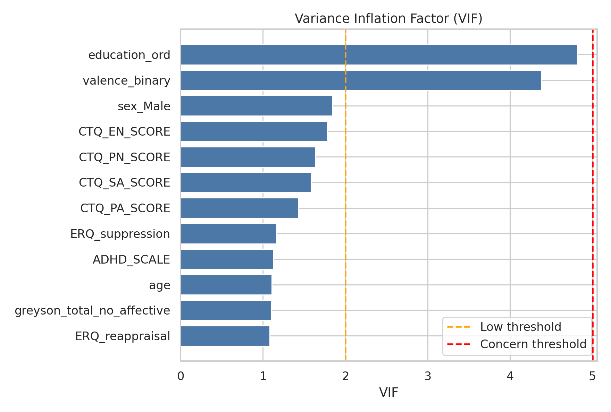
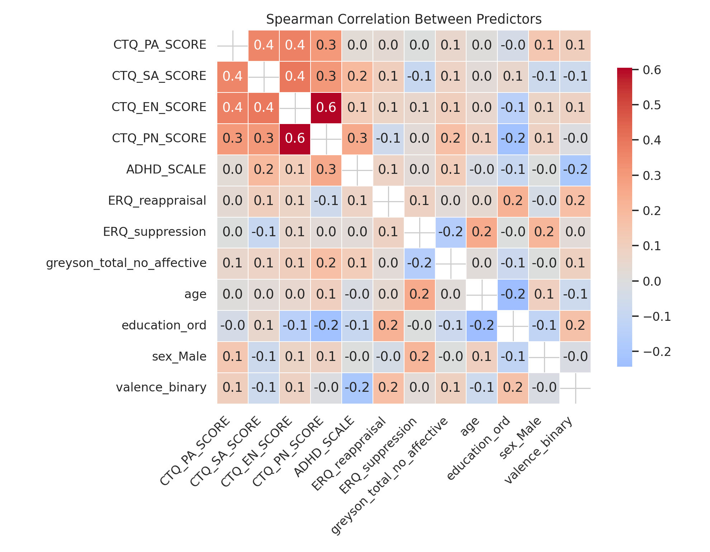
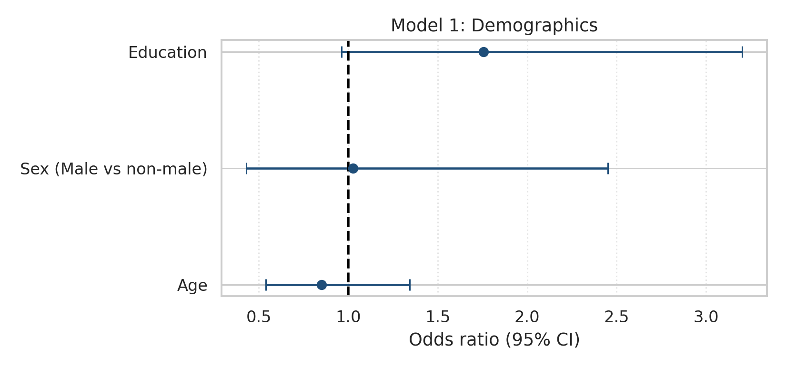
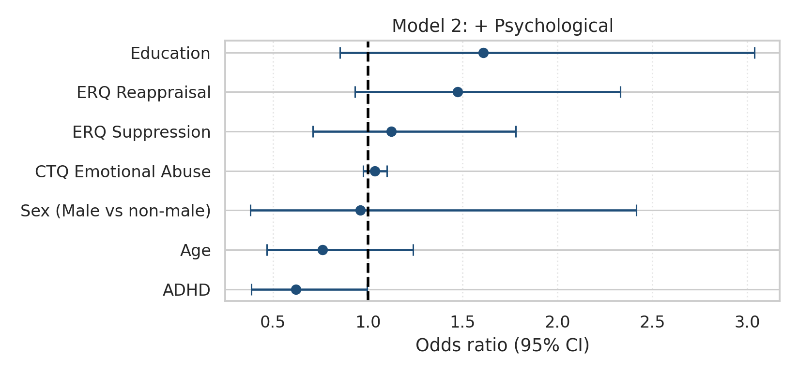
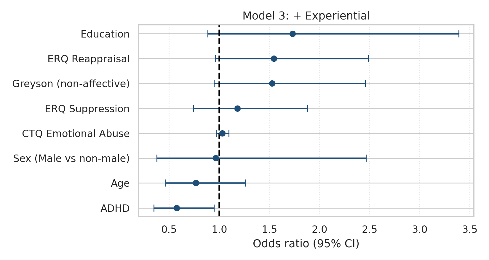
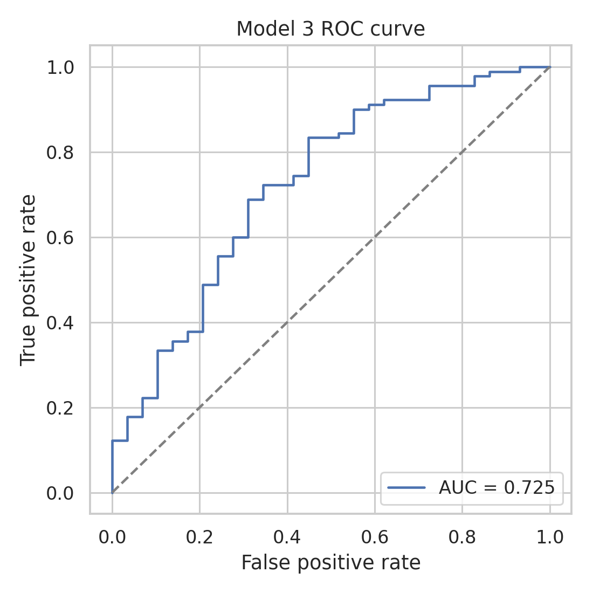
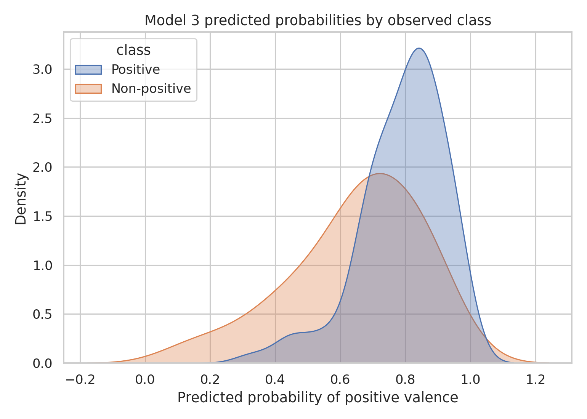

# Valence Multivariate Modeling Report

## Research Question

Do demographic, psychological, and experiential variables independently predict NDE valence?

## Valence Class Distribution

Original valence distribution:

```
 valence  n    pct
Positive 90 75.630
   Mixed 26 21.849
Negative  3  2.521
```

Binarized valence distribution used for modeling:

```
                 valence_binary  n   pct
                       Positive 90 75.63
Non-positive (Mixed + Negative) 29 24.37
```

Mixed and Negative categories are grouped into a single non-positive class to ensure adequate group size and stable estimation in multivariate models.

## Methodology

- Outcome: binary valence (`Positive = 1`, `Mixed/Negative = 0`).
- Models: hierarchical logistic regression.
  - Model 1: demographics only.
  - Model 2: demographics + psychological factors.
  - Model 3: demographics + psychological + experiential factor.
- Missing data handling: complete-case per model.
- Fit diagnostics: pseudo-R² and likelihood-ratio tests.
- Multiple-testing control: Benjamini-Hochberg FDR correction for predictor-level and model-comparison p-values.

## Model Sample Sizes

```
  model   n  pseudo_r2
Model 1 119      0.037
Model 2 119      0.100
Model 3 119      0.125
```

## Likelihood-Ratio Comparisons

```
        comparison  lr_stat  df_diff  p_value  p_value_fdr p_value_fdr_reject
Model 2 vs Model 1    8.343      4.0    0.080         0.08                 No
Model 3 vs Model 2    3.233      1.0    0.072         0.08                 No
```

## Multicollinearity Diagnostics (VIF)

VIF is computed using valence, demographic variables, CTQ subscales, ADHD, ERQ scores, and Greyson non-affective score.

```
                 predictor   vif collinearity
             education_ord 4.818     Moderate
            valence_binary 4.378     Moderate
                  sex_Male 1.847          Low
              CTQ_EN_SCORE 1.783          Low
              CTQ_PN_SCORE 1.640          Low
              CTQ_SA_SCORE 1.582          Low
              CTQ_PA_SCORE 1.434          Low
           ERQ_suppression 1.166          Low
                ADHD_SCALE 1.129          Low
                       age 1.108          Low
greyson_total_no_affective 1.105          Low
           ERQ_reappraisal 1.084          Low
```



## Predictor Correlation Heatmap

Spearman correlations among predictors are shown below to visualize dependence structure.



## Coefficients (Odds Ratios)

### Model 1

```
             predictor   coef    or  ci_low  ci_high  p_value  p_value_fdr p_value_fdr_reject
                   Age -0.161 0.851   0.540    1.342    0.488        0.731                 No
             Education  0.563 1.756   0.962    3.203    0.067        0.200                 No
Sex (Male vs non-male)  0.027 1.027   0.430    2.451    0.952        0.952                 No
```

### Model 2

```
             predictor   coef    or  ci_low  ci_high  p_value  p_value_fdr p_value_fdr_reject
                   Age -0.273 0.761   0.468    1.239    0.272        0.381                 No
             Education  0.476 1.609   0.852    3.040    0.142        0.332                 No
Sex (Male vs non-male) -0.042 0.959   0.381    2.416    0.929        0.929                 No
   CTQ Emotional Abuse  0.036 1.036   0.976    1.100    0.244        0.381                 No
                  ADHD -0.478 0.620   0.386    0.996    0.048        0.332                 No
       ERQ Reappraisal  0.388 1.474   0.931    2.333    0.098        0.332                 No
       ERQ Suppression  0.117 1.124   0.710    1.781    0.618        0.722                 No
```

### Model 3

```
              predictor   coef    or  ci_low  ci_high  p_value  p_value_fdr p_value_fdr_reject
                    Age -0.266 0.767   0.466    1.261    0.295        0.442                 No
              Education  0.550 1.733   0.886    3.388    0.108        0.216                 No
 Sex (Male vs non-male) -0.036 0.965   0.378    2.464    0.940        0.940                 No
    CTQ Emotional Abuse  0.030 1.031   0.969    1.096    0.331        0.442                 No
                   ADHD -0.554 0.574   0.348    0.949    0.031        0.216                 No
        ERQ Reappraisal  0.436 1.546   0.962    2.487    0.072        0.216                 No
        ERQ Suppression  0.166 1.181   0.741    1.882    0.484        0.553                 No
Greyson (non-affective)  0.423 1.526   0.949    2.454    0.081        0.216                 No
```

## Figures

### Model 1 Odds-Ratio Forest



### Model 2 Odds-Ratio Forest



### Model 3 Odds-Ratio Forest



### Model 3 ROC



### Model 3 Predicted Probabilities



## Interpretation

Model fit improved from pseudo-R²=0.037 (demographics only) to pseudo-R²=0.125 (full model). LR tests indicated FDR-adjusted p=0.080 for Model 2 vs 1 and p=0.080 for Model 3 vs 2. Model 3 ROC AUC=0.725.

## Limitations

- Complete-case analysis can reduce effective sample size.
- Logistic model estimates are association-based and do not imply causality.