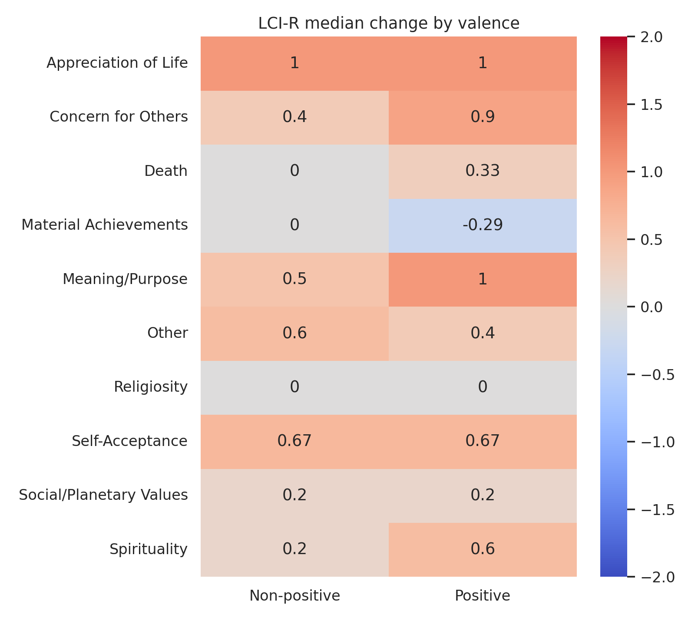
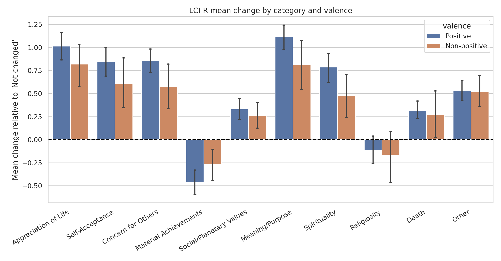
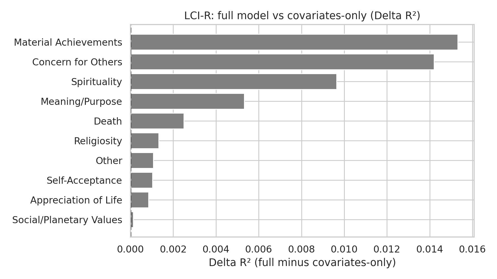
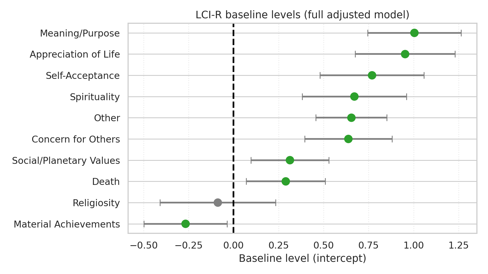
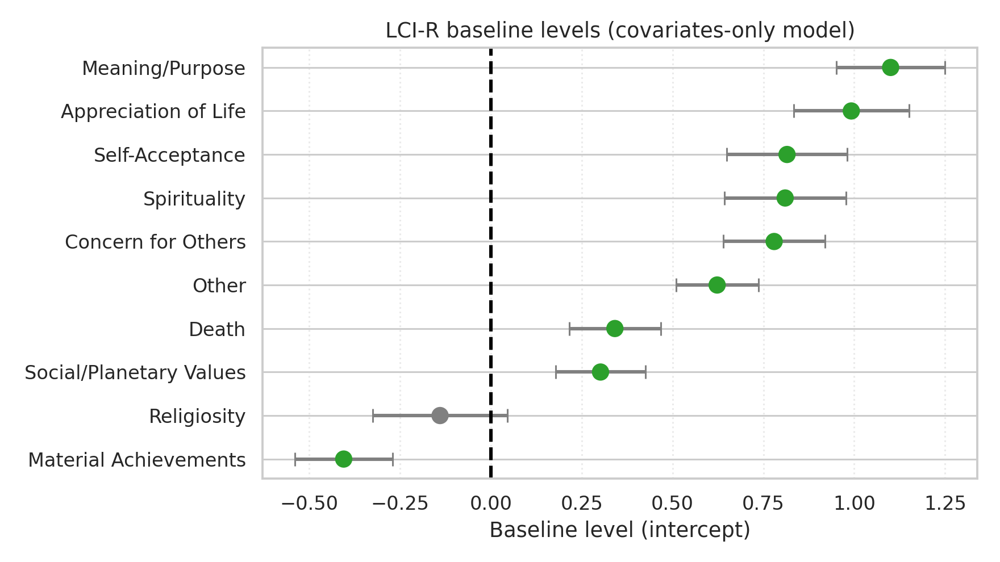

# Post-NDE Effects Report

## Scope

This report summarizes post-NDE effects for LCI-R.

## Methodology

- Global change versus zero: Wilcoxon signed-rank test.
- Positive vs non-positive valence comparison: Mann-Whitney U test.
- Multiple-testing control: Benjamini-Hochberg FDR correction within each hypothesis family.
- Adjusted OLS models:
  - Full model: `outcome ~ valence + covariates`
  - Covariates-only model: `outcome ~ covariates`
- Model comparison: R², AIC, BIC, and delta metrics.

## Global Change

```
               category  median   mean  p_value   n  p_value_fdr p_value_fdr_reject
        Meaning/Purpose   1.000  1.042    0.000 119        0.000                Yes
     Concern for Others   0.800  0.790    0.000 119        0.000                Yes
   Appreciation of Life   1.000  0.968    0.000 119        0.000                Yes
                  Other   0.400  0.530    0.000 119        0.000                Yes
        Self-Acceptance   0.667  0.787    0.000 119        0.000                Yes
           Spirituality   0.600  0.711    0.000 119        0.000                Yes
  Material Achievements  -0.286 -0.417    0.000 119        0.000                Yes
Social/Planetary Values   0.200  0.316    0.000 119        0.000                Yes
                  Death   0.333  0.308    0.000 119        0.000                Yes
            Religiosity   0.000 -0.126    0.128 119        0.128                 No
```

## Differences by Valence

```
               category  mean_positive  mean_non_positive  median_positive  median_non_positive  p_value  n_positive  n_non_positive  p_value_fdr p_value_fdr_reject
     Concern for Others          0.860              0.572            0.900                0.400    0.035          90              29        0.116                 No
        Meaning/Purpose          1.117              0.810            1.000                0.500    0.034          90              29        0.116                 No
           Spirituality          0.787              0.476            0.600                0.200    0.033          90              29        0.116                 No
   Appreciation of Life          1.016              0.819            1.000                1.000    0.214          90              29        0.356                 No
  Material Achievements         -0.465             -0.266           -0.286                0.000    0.154          90              29        0.356                 No
        Self-Acceptance          0.844              0.609            0.667                0.667    0.207          90              29        0.356                 No
                  Death          0.319              0.276            0.333                0.000    0.334          90              29        0.478                 No
Social/Planetary Values          0.333              0.262            0.200                0.200    0.612          90              29        0.765                 No
            Religiosity         -0.114             -0.164            0.000                0.000    0.947          90              29        0.980                 No
                  Other          0.532              0.522            0.400                0.600    0.980          90              29        0.980                 No
```

## Adjusted Models (Full)

```
                outcome   N  baseline  baseline_ci_low  baseline_ci_high  baseline_p  baseline_p_fdr  valence_beta  valence_ci_low  valence_ci_high  valence_p  valence_p_fdr    r2     aic     bic
  Material Achievements 119    -0.267           -0.497            -0.036       0.024           0.027        -0.181          -0.429            0.066      0.150          0.793 0.206 203.099 230.890
     Concern for Others 119     0.638            0.395             0.880       0.000           0.000         0.186          -0.074            0.447      0.159          0.793 0.232 214.919 242.710
        Self-Acceptance 119     0.769            0.480             1.058       0.000           0.000         0.060          -0.250            0.370      0.700          0.814 0.252 256.523 284.314
   Appreciation of Life 119     0.953            0.676             1.229       0.000           0.000         0.051          -0.245            0.348      0.732          0.814 0.217 246.150 273.941
        Meaning/Purpose 119     1.004            0.745             1.264       0.000           0.000         0.126          -0.153            0.404      0.373          0.814 0.276 231.062 258.853
           Spirituality 119     0.671            0.381             0.961       0.000           0.000         0.183          -0.129            0.494      0.248          0.814 0.222 257.393 285.184
            Religiosity 119    -0.088           -0.409             0.234       0.591           0.591        -0.068          -0.413            0.277      0.695          0.814 0.069 281.933 309.724
                  Death 119     0.290            0.071             0.509       0.010           0.013         0.068          -0.167            0.303      0.569          0.814 0.167 190.808 218.599
                  Other 119     0.654            0.457             0.851       0.000           0.000        -0.042          -0.253            0.170      0.698          0.814 0.233 165.296 193.087
Social/Planetary Values 119     0.313            0.097             0.529       0.005           0.007        -0.014          -0.246            0.218      0.902          0.902 0.079 187.490 215.281
```

## Adjusted Models (Covariates-Only)

```
                outcome   N  baseline  baseline_ci_low  baseline_ci_high  baseline_p  baseline_p_fdr    r2     aic     bic
   Appreciation of Life 119     0.992            0.833             1.151       0.000           0.000 0.216 244.278 269.290
     Concern for Others 119     0.780            0.639             0.920       0.000           0.000 0.218 215.099 240.111
                  Death 119     0.341            0.215             0.467       0.000           0.000 0.165 189.164 214.176
  Material Achievements 119    -0.405           -0.538            -0.271       0.000           0.000 0.191 203.373 228.385
        Meaning/Purpose 119     1.100            0.950             1.250       0.000           0.000 0.270 229.933 254.945
                  Other 119     0.623            0.510             0.736       0.000           0.000 0.232 163.461 188.474
            Religiosity 119    -0.140           -0.324             0.045       0.137           0.137 0.068 280.102 305.114
        Self-Acceptance 119     0.815            0.649             0.981       0.000           0.000 0.251 254.685 279.698
Social/Planetary Values 119     0.302            0.178             0.426       0.000           0.000 0.079 185.507 210.519
           Spirituality 119     0.810            0.642             0.977       0.000           0.000 0.212 256.860 281.872
```

## Full vs Covariates-Only Comparison

```
                outcome   N  valence_beta  valence_ci_low  valence_ci_high  valence_p  valence_p_fdr valence_fdr_reject  R2_full  R2_cov_only  delta_R2  delta_AIC  delta_BIC valence_adds_signal
  Material Achievements 119        -0.181          -0.429            0.066      0.150          0.793                 No    0.206        0.191     0.015     -0.274      2.505                  No
     Concern for Others 119         0.186          -0.074            0.447      0.159          0.793                 No    0.232        0.218     0.014     -0.180      2.599                  No
        Self-Acceptance 119         0.060          -0.250            0.370      0.700          0.814                 No    0.252        0.251     0.001      1.837      4.616                  No
   Appreciation of Life 119         0.051          -0.245            0.348      0.732          0.814                 No    0.217        0.216     0.001      1.872      4.651                  No
        Meaning/Purpose 119         0.126          -0.153            0.404      0.373          0.814                 No    0.276        0.270     0.005      1.129      3.908                  No
           Spirituality 119         0.183          -0.129            0.494      0.248          0.814                 No    0.222        0.212     0.010      0.533      3.313                  No
            Religiosity 119        -0.068          -0.413            0.277      0.695          0.814                 No    0.069        0.068     0.001      1.831      4.611                  No
                  Death 119         0.068          -0.167            0.303      0.569          0.814                 No    0.167        0.165     0.002      1.644      4.423                  No
                  Other 119        -0.042          -0.253            0.170      0.698          0.814                 No    0.233        0.232     0.001      1.834      4.613                  No
Social/Planetary Values 119        -0.014          -0.246            0.218      0.902          0.902                 No    0.079        0.079     0.000      1.983      4.762                  No
```

## Figures













## Interpretation

0 outcomes showed evidence that valence adds explanatory value beyond covariates after FDR correction. Interpretation is based on FDR-adjusted valence p-values in the full model and model-fit deltas between full and covariates-only specifications.