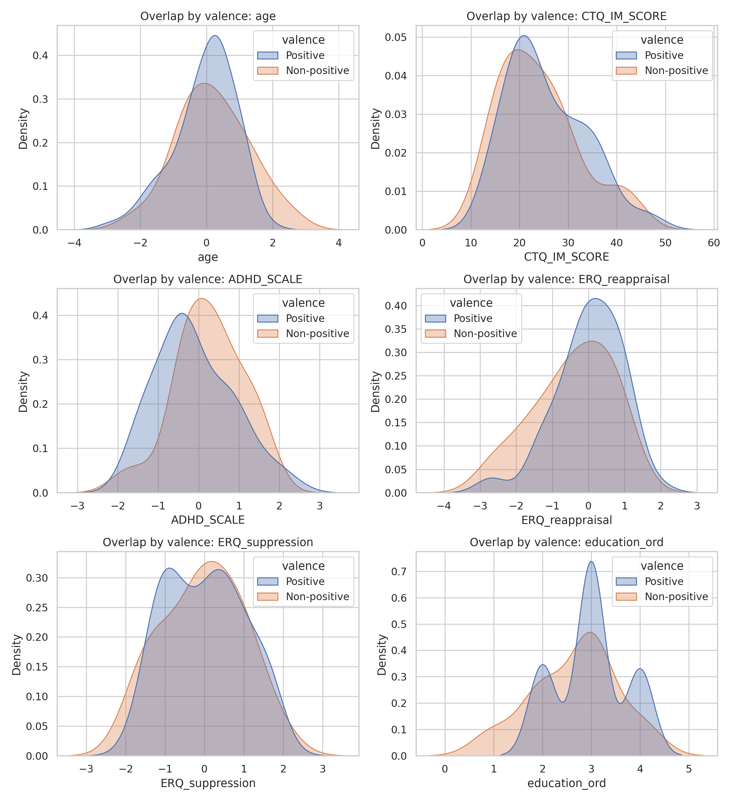
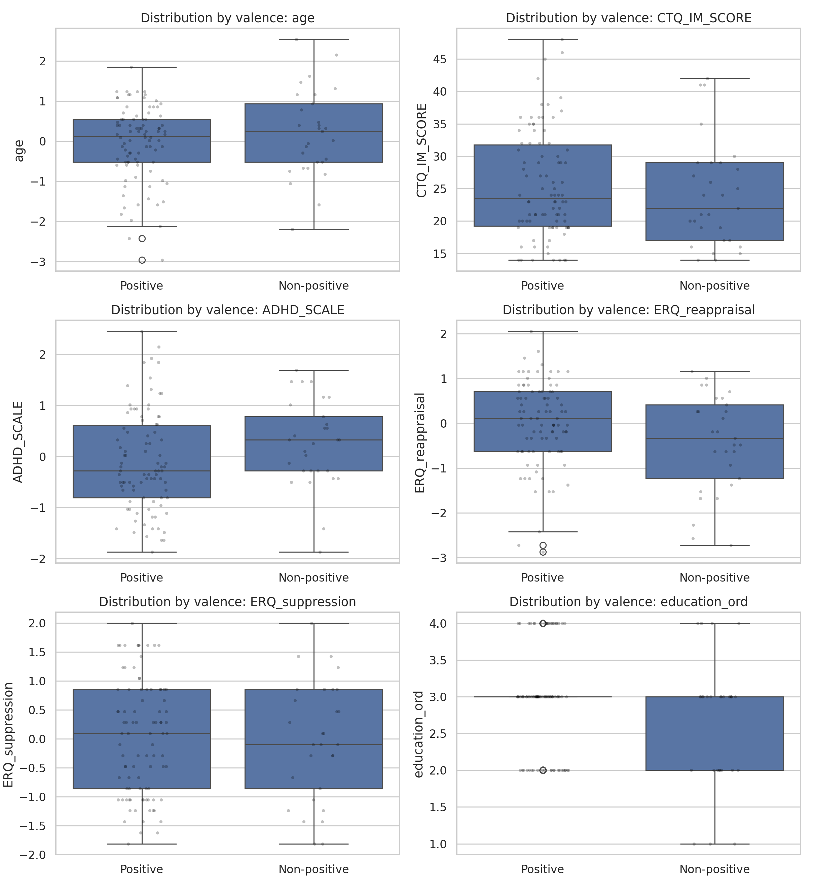
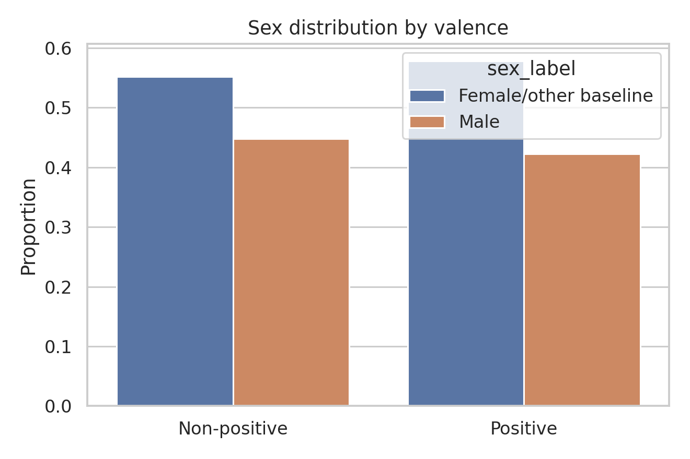

# Covariate Diagnostics Report

## Purpose

Evaluate covariate overlap and group balance between positive and non-positive valence groups before adjusted outcome modeling.

## Methodology

- Continuous and ordinal covariates: Mann-Whitney U tests.
- Categorical covariate (`sex_Male`): chi-square test.
- Analysis sample: complete-case intersection across `valence_binary`, `sex_Male`, `age`, `CTQ_IM_SCORE`, `ADHD_SCALE`, `ERQ_reappraisal`, `ERQ_suppression`, and `education_ord`.
- Multiple-testing control: Benjamini-Hochberg FDR correction across balance tests.
- Visual diagnostics:
  - KDE overlap by valence
  - box/strip distributions by valence
  - sex distribution bar chart

## Overall Descriptive Statistics (Pre-Transformation)

```
       variable   n   mean    std
            age 119 60.916 12.747
   CTQ_IM_SCORE 119 25.176  8.132
     ADHD_SCALE 119 26.437 12.516
ERQ_reappraisal 119  4.605  1.103
ERQ_suppression 119  3.374  1.307
  education_ord 119  2.908  0.748
```

### Categorical Variable Summary

```
variable          top_category  top_pct   n
sex_Male Female/other baseline   57.143 119
```

## Descriptive Summary by Valence

```
       variable      valence  count   mean   std  median    min    max
            age Non-positive     29  0.192 1.084   0.245 -2.198  2.536
            age     Positive     90 -0.049 0.934   0.130 -2.962  1.848
   CTQ_IM_SCORE Non-positive     29 24.000 8.142  22.000 14.000 42.000
   CTQ_IM_SCORE     Positive     90 25.556 8.138  23.500 14.000 48.000
     ADHD_SCALE Non-positive     29  0.254 0.846   0.330 -1.866  1.693
     ADHD_SCALE     Positive     90 -0.103 0.967  -0.276 -1.866  2.450
ERQ_reappraisal Non-positive     29 -0.432 1.090  -0.334 -2.724  1.159
ERQ_reappraisal     Positive     90  0.019 0.933   0.114 -2.873  2.055
ERQ_suppression Non-positive     29 -0.040 1.030  -0.099 -1.812  1.995
ERQ_suppression     Positive     90  0.007 0.989   0.091 -1.812  1.995
  education_ord Non-positive     29  2.655 0.857   3.000  1.000  4.000
  education_ord     Positive     90  2.989 0.695   3.000  2.000  4.000
```

## Balance Tests

```
       variable               type  p_value  mean_positive  mean_non_positive  p_value_fdr p_value_fdr_reject
ERQ_reappraisal continuous/ordinal    0.059          0.019             -0.432        0.181                 No
     ADHD_SCALE continuous/ordinal    0.034         -0.103              0.254        0.181                 No
  education_ord continuous/ordinal    0.077          2.989              2.655        0.181                 No
   CTQ_IM_SCORE continuous/ordinal    0.337         25.556             24.000        0.589                 No
            age continuous/ordinal    0.467         -0.049              0.192        0.653                 No
ERQ_suppression continuous/ordinal    0.828          0.007             -0.040        0.966                 No
       sex_Male        categorical    0.975          0.422              0.448        0.975                 No
```

## Figures







## Interpretation

0 covariates were imbalanced at FDR-adjusted p<0.05 and 0 at FDR-adjusted p<0.10. Distribution overlap plots and balance tests jointly support whether adjusted analysis is plausible.