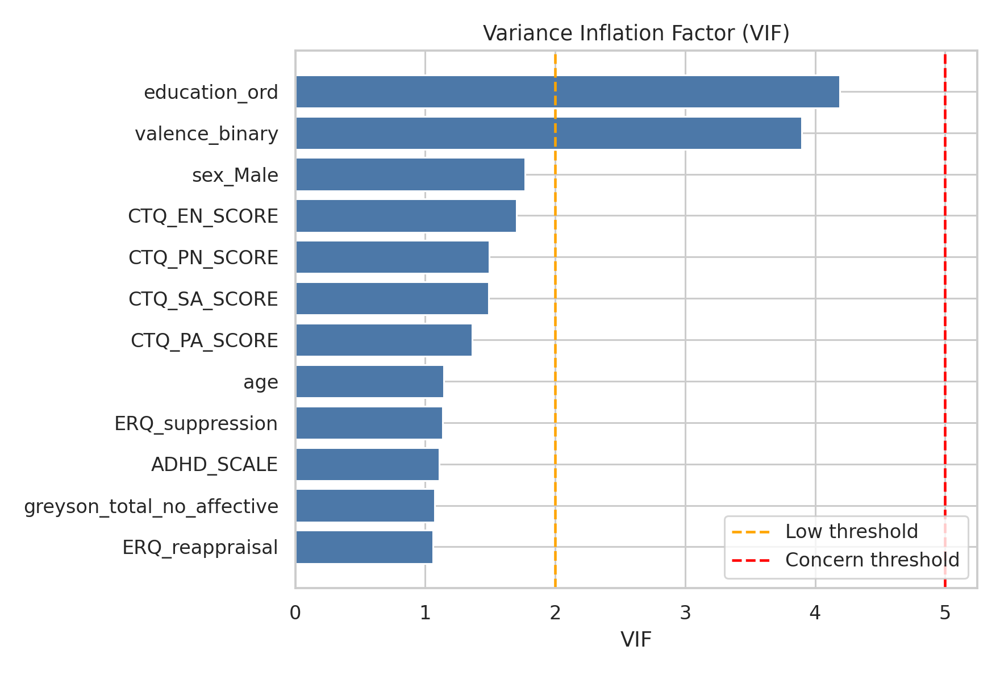
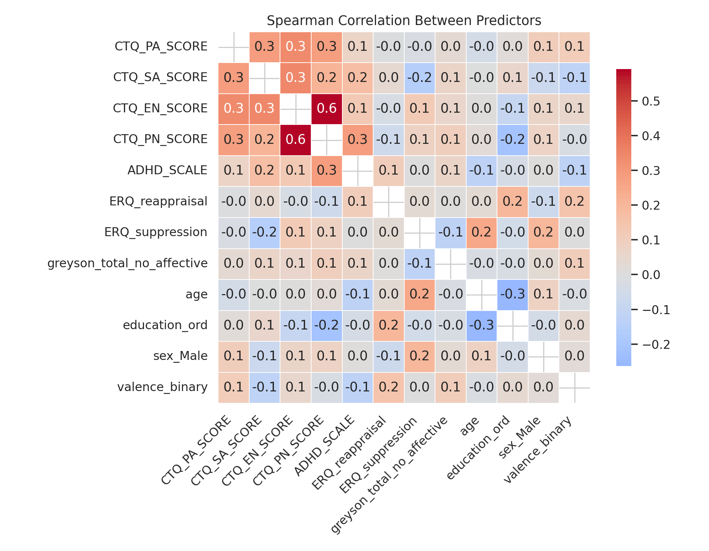
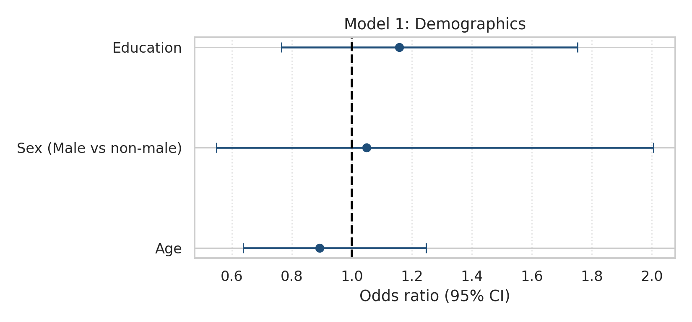
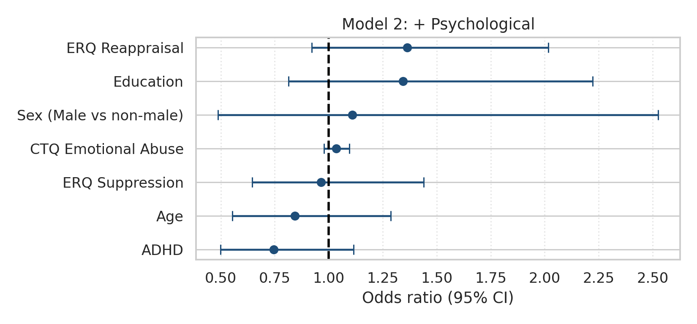
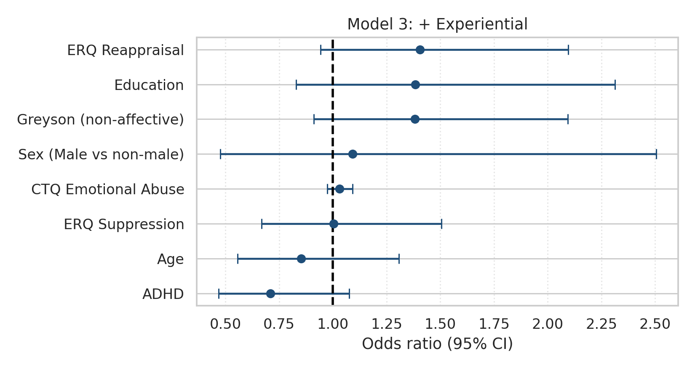
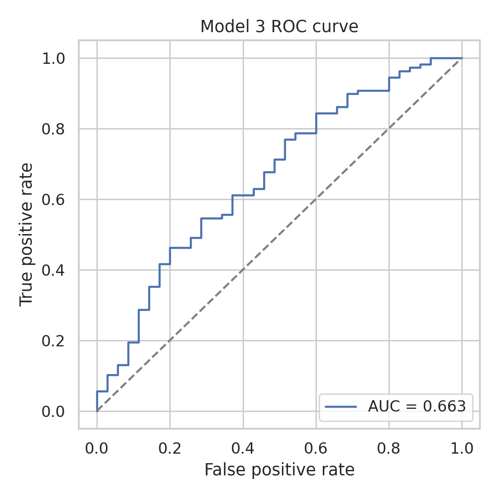
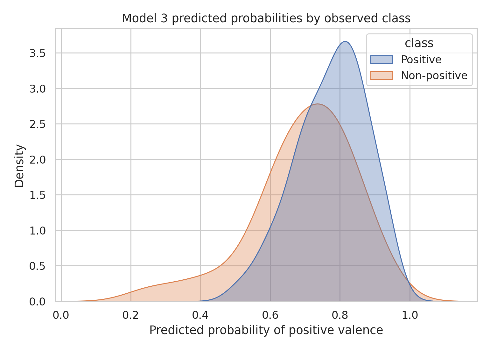

# Valence Multivariate Modeling Report

## Research Question

Do demographic, psychological, and experiential variables independently predict NDE valence?

## Valence Class Distribution

Original valence distribution:

```
 valence   n    pct
Positive 161 74.194
   Mixed  48 22.120
Negative   8  3.687
```

Binarized valence distribution used for modeling:

```
                 valence_binary   n    pct
                       Positive 161 74.194
Non-positive (Mixed + Negative)  56 25.806
```

Mixed and Negative categories are grouped into a single non-positive class to ensure adequate group size and stable estimation in multivariate models.

## Methodology

- Outcome: binary valence (`Positive = 1`, `Mixed/Negative = 0`).
- Models: hierarchical logistic regression.
  - Model 1: demographics only.
  - Model 2: demographics + psychological factors.
  - Model 3: demographics + psychological + experiential factor.
- Missing data handling: complete-case per model.
- Fit diagnostics: pseudo-R² and likelihood-ratio tests.
- Multiple-testing control: Benjamini-Hochberg FDR correction for predictor-level and model-comparison p-values.

## Model Sample Sizes

```
  model   n  pseudo_r2
Model 1 202      0.005
Model 2 143      0.052
Model 3 143      0.067
```

## Likelihood-Ratio Comparisons

```
        comparison  lr_stat  df_diff  p_value  p_value_fdr p_value_fdr_reject
Model 2 vs Model 1   76.192      4.0     0.00         0.00                Yes
Model 3 vs Model 2    2.423      1.0     0.12         0.12                 No
```

## Multicollinearity Diagnostics (VIF)

VIF is computed using valence, demographic variables, CTQ subscales, ADHD, ERQ scores, and Greyson non-affective score.

```
                 predictor   vif collinearity
             education_ord 4.190     Moderate
            valence_binary 3.897     Moderate
                  sex_Male 1.767          Low
              CTQ_EN_SCORE 1.700          Low
              CTQ_PN_SCORE 1.493          Low
              CTQ_SA_SCORE 1.489          Low
              CTQ_PA_SCORE 1.363          Low
                       age 1.143          Low
           ERQ_suppression 1.134          Low
                ADHD_SCALE 1.106          Low
greyson_total_no_affective 1.074          Low
           ERQ_reappraisal 1.061          Low
```



## Predictor Correlation Heatmap

Spearman correlations among predictors are shown below to visualize dependence structure.



## Coefficients (Odds Ratios)

### Model 1

```
             predictor   coef    or  ci_low  ci_high  p_value  p_value_fdr p_value_fdr_reject
                   Age -0.114 0.892   0.638    1.248    0.505        0.757                 No
             Education  0.146 1.158   0.765    1.752    0.488        0.757                 No
Sex (Male vs non-male)  0.048 1.049   0.549    2.006    0.885        0.885                 No
```

### Model 2

```
             predictor   coef    or  ci_low  ci_high  p_value  p_value_fdr p_value_fdr_reject
                   Age -0.169 0.844   0.553    1.288    0.431        0.604                 No
             Education  0.296 1.345   0.814    2.221    0.247        0.433                 No
Sex (Male vs non-male)  0.104 1.110   0.488    2.526    0.804        0.862                 No
   CTQ Emotional Abuse  0.034 1.035   0.979    1.095    0.227        0.433                 No
                  ADHD -0.293 0.746   0.499    1.115    0.153        0.433                 No
       ERQ Reappraisal  0.309 1.363   0.921    2.017    0.122        0.433                 No
       ERQ Suppression -0.036 0.965   0.646    1.441    0.862        0.862                 No
```

### Model 3

```
              predictor   coef    or  ci_low  ci_high  p_value  p_value_fdr p_value_fdr_reject
                    Age -0.159 0.853   0.557    1.308    0.466        0.621                 No
              Education  0.325 1.384   0.828    2.312    0.215        0.430                 No
 Sex (Male vs non-male)  0.088 1.092   0.476    2.506    0.836        0.955                 No
    CTQ Emotional Abuse  0.031 1.032   0.975    1.092    0.283        0.454                 No
                   ADHD -0.343 0.710   0.468    1.077    0.107        0.339                 No
        ERQ Reappraisal  0.340 1.405   0.943    2.095    0.095        0.339                 No
        ERQ Suppression  0.003 1.003   0.668    1.506    0.988        0.988                 No
Greyson (non-affective)  0.323 1.382   0.912    2.094    0.127        0.339                 No
```

## Figures

### Model 1 Odds-Ratio Forest



### Model 2 Odds-Ratio Forest



### Model 3 Odds-Ratio Forest



### Model 3 ROC



### Model 3 Predicted Probabilities



## Interpretation

Model fit improved from pseudo-R²=0.005 (demographics only) to pseudo-R²=0.067 (full model). LR tests indicated FDR-adjusted p=0.000 for Model 2 vs 1 and p=0.120 for Model 3 vs 2. Model 3 ROC AUC=0.663.

## Limitations

- Complete-case analysis can reduce effective sample size.
- Logistic model estimates are association-based and do not imply causality.