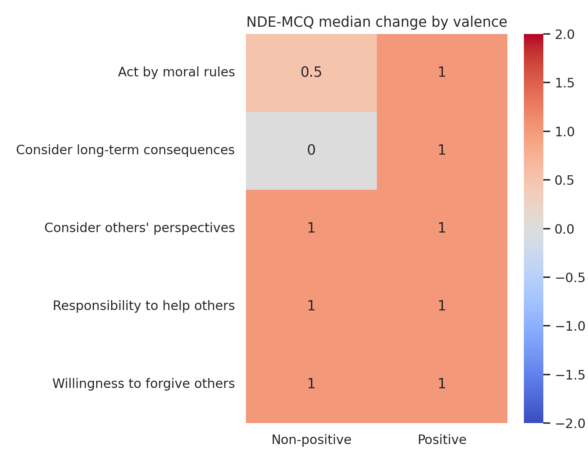
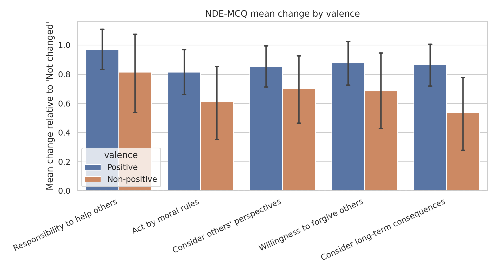
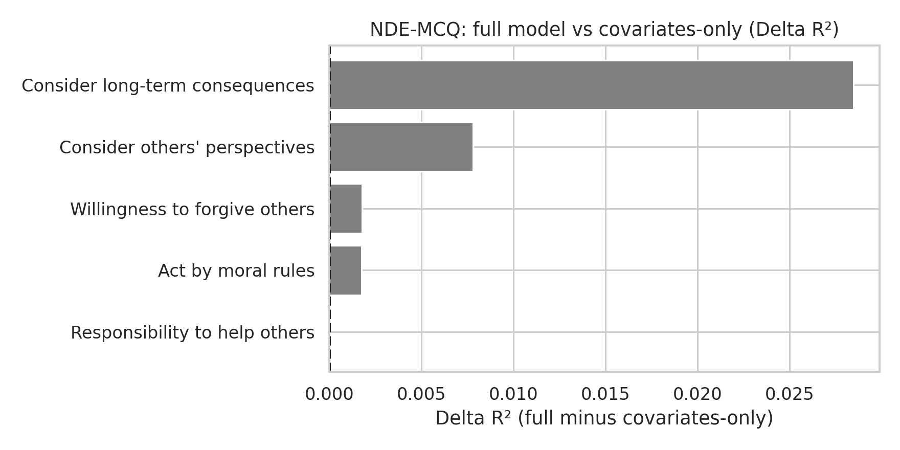

# Post-NDE Effects Report

## Scope

This report summarizes post-NDE effects for NDE-MCQ.

## Methodology

- Global change versus zero: Wilcoxon signed-rank test.
- Positive vs non-positive valence comparison: Mann-Whitney U test.
- Multiple-testing control: Benjamini-Hochberg FDR correction within each hypothesis family.
- Adjusted OLS models:
  - Full model: `outcome ~ valence + covariates`
  - Covariates-only model: `outcome ~ covariates`
- Model comparison: R², AIC, BIC, and delta metrics.

## Global Change

```
                           item  median  mean  p_value   n  p_value_fdr p_value_fdr_reject
  Responsibility to help others     1.0 0.929      0.0 210          0.0                Yes
  Consider others' perspectives     1.0 0.814      0.0 210          0.0                Yes
  Willingness to forgive others     1.0 0.829      0.0 210          0.0                Yes
Consider long-term consequences     1.0 0.781      0.0 210          0.0                Yes
             Act by moral rules     1.0 0.762      0.0 210          0.0                Yes
```

## Differences by Valence

```
                           item  mean_positive  mean_non_positive  median_positive  median_non_positive  p_value  n_positive  n_non_positive  p_value_fdr p_value_fdr_reject
Consider long-term consequences          0.865              0.537              1.0                  0.0    0.037         156              54        0.187                 No
             Act by moral rules          0.814              0.611              1.0                  0.5    0.143         156              54        0.238                 No
  Willingness to forgive others          0.878              0.685              1.0                  1.0    0.117         156              54        0.238                 No
  Consider others' perspectives          0.853              0.704              1.0                  1.0    0.243         156              54        0.303                 No
  Responsibility to help others          0.968              0.815              1.0                  1.0    0.377         156              54        0.377                 No
```

## Adjusted Models (Full)

```
                        outcome   N  baseline  baseline_ci_low  baseline_ci_high  baseline_p  baseline_p_fdr  valence_beta  valence_ci_low  valence_ci_high  valence_p  valence_p_fdr    r2     aic     bic
Consider long-term consequences 143     0.410            0.059             0.762       0.022           0.022         0.395           0.014            0.777      0.042          0.212 0.098 402.356 431.984
  Consider others' perspectives 143     0.570            0.255             0.884       0.000           0.001         0.189          -0.153            0.530      0.276          0.690 0.133 370.421 400.049
  Willingness to forgive others 143     0.622            0.270             0.973       0.001           0.001         0.102          -0.280            0.484      0.598          0.759 0.156 402.547 432.175
             Act by moral rules 143     0.549            0.195             0.904       0.003           0.003         0.100          -0.284            0.485      0.607          0.759 0.128 404.676 434.305
  Responsibility to help others 143     0.898            0.570             1.227       0.000           0.000         0.000          -0.356            0.356      0.999          0.999 0.093 382.729 412.358
```

## Adjusted Models (Covariates-Only)

```
                        outcome   N  baseline  baseline_ci_low  baseline_ci_high  baseline_p  baseline_p_fdr    r2     aic     bic
             Act by moral rules 143     0.624            0.417             0.831         0.0             0.0 0.126 402.962 429.627
Consider long-term consequences 143     0.705            0.496             0.914         0.0             0.0 0.069 404.800 431.465
  Consider others' perspectives 143     0.710            0.526             0.895         0.0             0.0 0.125 369.701 396.367
  Responsibility to help others 143     0.899            0.707             1.090         0.0             0.0 0.093 380.729 407.395
  Willingness to forgive others 143     0.698            0.492             0.904         0.0             0.0 0.154 400.847 427.513
```

## Full vs Covariates-Only Comparison

```
                        outcome   N  valence_beta  valence_ci_low  valence_ci_high  valence_p  valence_p_fdr valence_fdr_reject  R2_full  R2_cov_only  delta_R2  delta_AIC  delta_BIC valence_adds_signal
Consider long-term consequences 143         0.395           0.014            0.777      0.042          0.212                 No    0.098        0.069     0.028     -2.444      0.519                  No
  Consider others' perspectives 143         0.189          -0.153            0.530      0.276          0.690                 No    0.133        0.125     0.008      0.719      3.682                  No
  Willingness to forgive others 143         0.102          -0.280            0.484      0.598          0.759                 No    0.156        0.154     0.002      1.700      4.663                  No
             Act by moral rules 143         0.100          -0.284            0.485      0.607          0.759                 No    0.128        0.126     0.002      1.715      4.677                  No
  Responsibility to help others 143         0.000          -0.356            0.356      0.999          0.999                 No    0.093        0.093     0.000      2.000      4.963                  No
```

## Figures









## Interpretation

0 outcomes showed evidence that valence adds explanatory value beyond covariates after FDR correction. Interpretation is based on FDR-adjusted valence p-values in the full model and model-fit deltas between full and covariates-only specifications.