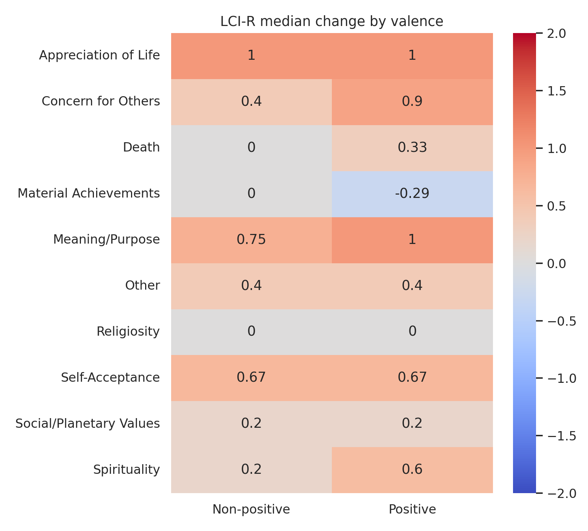
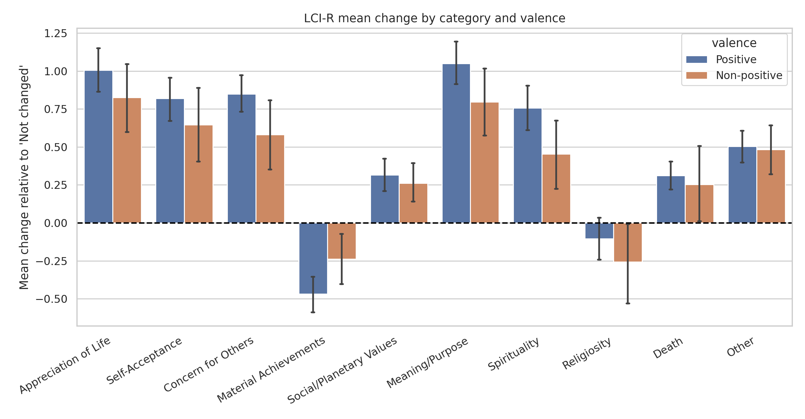
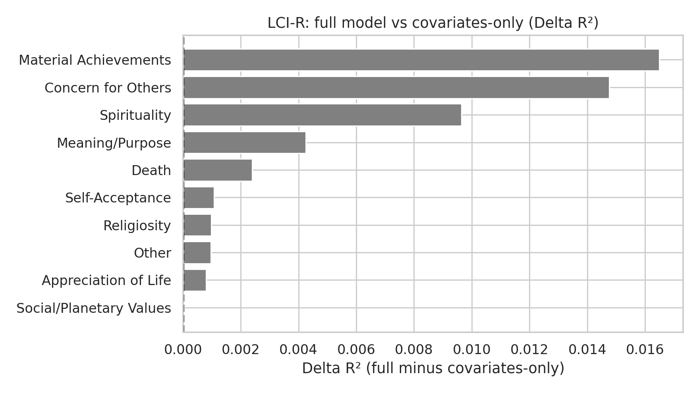
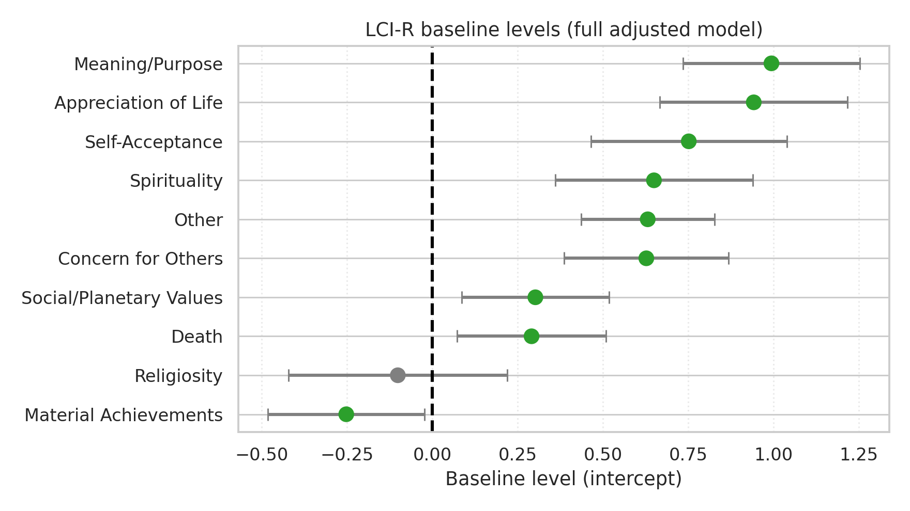
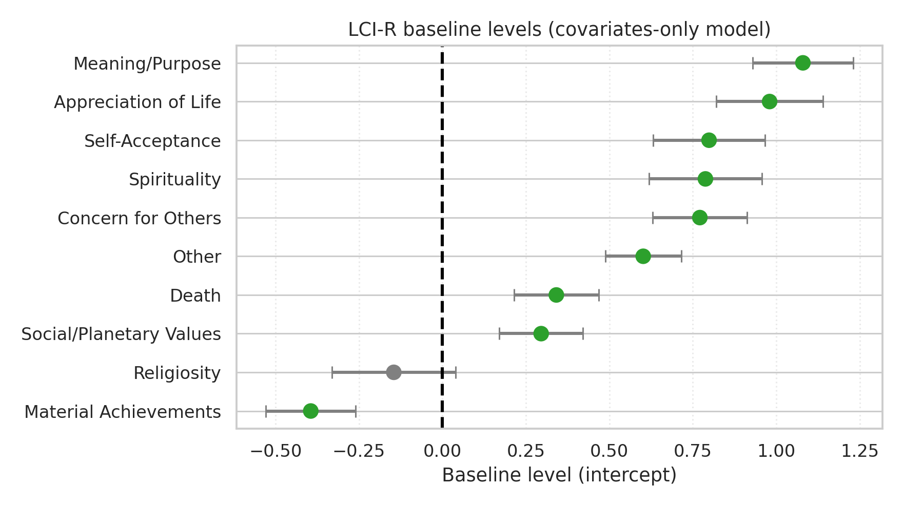

# Post-NDE Effects Report

## Scope

This report summarizes post-NDE effects for LCI-R.

## Methodology

- Global change versus zero: Wilcoxon signed-rank test.
- Positive vs non-positive valence comparison: Mann-Whitney U test.
- Multiple-testing control: Benjamini-Hochberg FDR correction within each hypothesis family.
- Adjusted OLS models:
  - Full model: `outcome ~ valence + covariates`
  - Covariates-only model: `outcome ~ covariates`
- Model comparison: R², AIC, BIC, and delta metrics.

## Global Change

```
               category  median   mean  p_value   n  p_value_fdr p_value_fdr_reject
     Concern for Others   0.800  0.780    0.000 129        0.000                Yes
        Meaning/Purpose   1.000  0.984    0.000 129        0.000                Yes
   Appreciation of Life   1.000  0.960    0.000 129        0.000                Yes
        Self-Acceptance   0.667  0.775    0.000 129        0.000                Yes
                  Other   0.400  0.498    0.000 129        0.000                Yes
           Spirituality   0.600  0.678    0.000 128        0.000                Yes
  Material Achievements  -0.286 -0.409    0.000 129        0.000                Yes
Social/Planetary Values   0.200  0.302    0.000 129        0.000                Yes
                  Death   0.333  0.297    0.000 129        0.000                Yes
            Religiosity   0.000 -0.143    0.064 129        0.064                 No
```

## Differences by Valence

```
               category  mean_positive  mean_non_positive  median_positive  median_non_positive  p_value  n_positive  n_non_positive  p_value_fdr p_value_fdr_reject
  Material Achievements         -0.468             -0.238           -0.286                0.000    0.064          96              33        0.160                 No
     Concern for Others          0.848              0.582            0.900                0.400    0.035          96              33        0.160                 No
           Spirituality          0.756              0.455            0.600                0.200    0.033          95              33        0.160                 No
        Meaning/Purpose          1.049              0.795            1.000                0.750    0.059          96              33        0.160                 No
   Appreciation of Life          1.006              0.826            1.000                1.000    0.252          96              33        0.420                 No
                  Death          0.312              0.253            0.333                0.000    0.223          96              33        0.420                 No
        Self-Acceptance          0.819              0.646            0.667                0.667    0.346          96              33        0.495                 No
            Religiosity         -0.104             -0.258            0.000                0.000    0.475          96              33        0.593                 No
Social/Planetary Values          0.317              0.261            0.200                0.200    0.670          96              33        0.745                 No
                  Other          0.503              0.483            0.400                0.400    0.948          96              33        0.948                 No
```

## Adjusted Models (Full)

```
                outcome   N  baseline  baseline_ci_low  baseline_ci_high  baseline_p  baseline_p_fdr  valence_beta  valence_ci_low  valence_ci_high  valence_p  valence_p_fdr    r2     aic     bic
  Material Achievements 120    -0.252           -0.482            -0.022       0.032           0.035        -0.187          -0.433            0.059      0.134          0.744 0.204 203.983 231.858
     Concern for Others 120     0.627            0.386             0.869       0.000           0.000         0.189          -0.069            0.448      0.149          0.744 0.232 215.625 243.500
        Self-Acceptance 120     0.752            0.465             1.039       0.000           0.000         0.062          -0.246            0.369      0.691          0.819 0.252 257.519 285.393
   Appreciation of Life 120     0.942            0.667             1.217       0.000           0.000         0.050          -0.244            0.344      0.737          0.819 0.218 247.059 274.934
        Meaning/Purpose 120     0.994            0.735             1.253       0.000           0.000         0.113          -0.164            0.391      0.421          0.819 0.282 232.981 260.856
           Spirituality 119     0.650            0.360             0.940       0.000           0.000         0.183          -0.129            0.494      0.248          0.819 0.222 257.393 285.184
            Religiosity 120    -0.101           -0.421             0.219       0.534           0.534        -0.059          -0.402            0.284      0.734          0.819 0.066 283.562 311.437
                  Death 120     0.291            0.073             0.509       0.009           0.012         0.066          -0.167            0.300      0.575          0.819 0.169 191.265 219.140
                  Other 120     0.632            0.436             0.827       0.000           0.000        -0.039          -0.249            0.170      0.710          0.819 0.240 165.567 193.442
Social/Planetary Values 120     0.302            0.087             0.517       0.006           0.009        -0.008          -0.239            0.222      0.942          0.942 0.077 188.274 216.149
```

## Adjusted Models (Covariates-Only)

```
                outcome   N  baseline  baseline_ci_low  baseline_ci_high  baseline_p  baseline_p_fdr    r2     aic     bic
   Appreciation of Life 120     0.980            0.820             1.140       0.000           0.000 0.217 245.182 270.270
     Concern for Others 120     0.771            0.630             0.913       0.000           0.000 0.217 215.910 240.997
                  Death 120     0.341            0.215             0.468       0.000           0.000 0.167 189.610 214.697
  Material Achievements 120    -0.394           -0.529            -0.260       0.000           0.000 0.188 204.446 229.534
        Meaning/Purpose 120     1.080            0.929             1.231       0.000           0.000 0.278 231.691 256.779
                  Other 120     0.602            0.488             0.715       0.000           0.000 0.239 163.719 188.806
            Religiosity 120    -0.146           -0.331             0.040       0.124           0.124 0.065 281.688 306.775
        Self-Acceptance 120     0.799            0.632             0.966       0.000           0.000 0.251 255.692 280.779
Social/Planetary Values 120     0.296            0.171             0.421       0.000           0.000 0.077 186.280 211.367
           Spirituality 119     0.788            0.619             0.957       0.000           0.000 0.212 256.860 281.872
```

## Full vs Covariates-Only Comparison

```
                outcome   N  valence_beta  valence_ci_low  valence_ci_high  valence_p  valence_p_fdr valence_fdr_reject  R2_full  R2_cov_only  delta_R2  delta_AIC  delta_BIC valence_adds_signal
  Material Achievements 120        -0.187          -0.433            0.059      0.134          0.744                 No    0.204        0.188     0.016     -0.463      2.324                  No
     Concern for Others 120         0.189          -0.069            0.448      0.149          0.744                 No    0.232        0.217     0.015     -0.285      2.503                  No
        Self-Acceptance 120         0.062          -0.246            0.369      0.691          0.819                 No    0.252        0.251     0.001      1.827      4.614                  No
   Appreciation of Life 120         0.050          -0.244            0.344      0.737          0.819                 No    0.218        0.217     0.001      1.877      4.664                  No
        Meaning/Purpose 120         0.113          -0.164            0.391      0.421          0.819                 No    0.282        0.278     0.004      1.290      4.078                  No
           Spirituality 119         0.183          -0.129            0.494      0.248          0.819                 No    0.222        0.212     0.010      0.533      3.313                  No
            Religiosity 120        -0.059          -0.402            0.284      0.734          0.819                 No    0.066        0.065     0.001      1.874      4.661                  No
                  Death 120         0.066          -0.167            0.300      0.575          0.819                 No    0.169        0.167     0.002      1.655      4.443                  No
                  Other 120        -0.039          -0.249            0.170      0.710          0.819                 No    0.240        0.239     0.001      1.848      4.636                  No
Social/Planetary Values 120        -0.008          -0.239            0.222      0.942          0.942                 No    0.077        0.077     0.000      1.994      4.782                  No
```

## Figures













## Interpretation

0 outcomes showed evidence that valence adds explanatory value beyond covariates after FDR correction. Interpretation is based on FDR-adjusted valence p-values in the full model and model-fit deltas between full and covariates-only specifications.