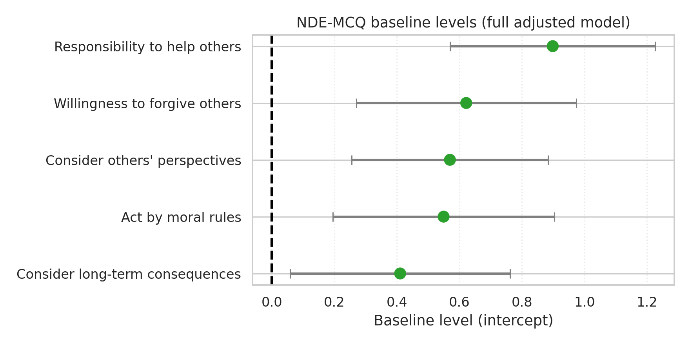
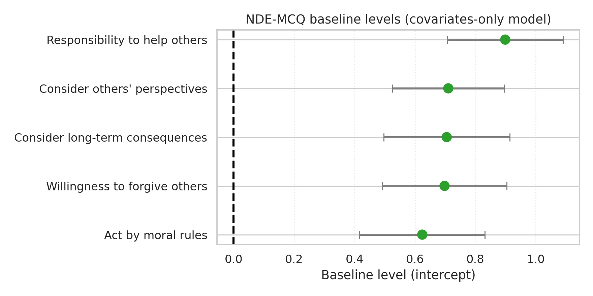

# Adjusted Models Comparison

## LCI-R: Full vs Covariates-Only

```
                outcome   N  valence_beta  valence_ci_low  valence_ci_high  valence_p  valence_p_fdr valence_fdr_reject  R2_full  R2_cov_only  delta_R2  delta_AIC  delta_BIC valence_adds_signal
  Material Achievements 120        -0.187          -0.433            0.059      0.134          0.744                 No    0.204        0.188     0.016     -0.463      2.324                  No
     Concern for Others 120         0.189          -0.069            0.448      0.149          0.744                 No    0.232        0.217     0.015     -0.285      2.503                  No
        Self-Acceptance 120         0.062          -0.246            0.369      0.691          0.819                 No    0.252        0.251     0.001      1.827      4.614                  No
   Appreciation of Life 120         0.050          -0.244            0.344      0.737          0.819                 No    0.218        0.217     0.001      1.877      4.664                  No
        Meaning/Purpose 120         0.113          -0.164            0.391      0.421          0.819                 No    0.282        0.278     0.004      1.290      4.078                  No
           Spirituality 119         0.183          -0.129            0.494      0.248          0.819                 No    0.222        0.212     0.010      0.533      3.313                  No
            Religiosity 120        -0.059          -0.402            0.284      0.734          0.819                 No    0.066        0.065     0.001      1.874      4.661                  No
                  Death 120         0.066          -0.167            0.300      0.575          0.819                 No    0.169        0.167     0.002      1.655      4.443                  No
                  Other 120        -0.039          -0.249            0.170      0.710          0.819                 No    0.240        0.239     0.001      1.848      4.636                  No
Social/Planetary Values 120        -0.008          -0.239            0.222      0.942          0.942                 No    0.077        0.077     0.000      1.994      4.782                  No
```


## NDE-MCQ: Full vs Covariates-Only

```
                        outcome   N  valence_beta  valence_ci_low  valence_ci_high  valence_p  valence_p_fdr valence_fdr_reject  R2_full  R2_cov_only  delta_R2  delta_AIC  delta_BIC valence_adds_signal
Consider long-term consequences 143         0.395           0.014            0.777      0.042          0.212                 No    0.098        0.069     0.028     -2.444      0.519                  No
  Consider others' perspectives 143         0.189          -0.153            0.530      0.276          0.690                 No    0.133        0.125     0.008      0.719      3.682                  No
  Willingness to forgive others 143         0.102          -0.280            0.484      0.598          0.759                 No    0.156        0.154     0.002      1.700      4.663                  No
             Act by moral rules 143         0.100          -0.284            0.485      0.607          0.759                 No    0.128        0.126     0.002      1.715      4.677                  No
  Responsibility to help others 143         0.000          -0.356            0.356      0.999          0.999                 No    0.093        0.093     0.000      2.000      4.963                  No
```





