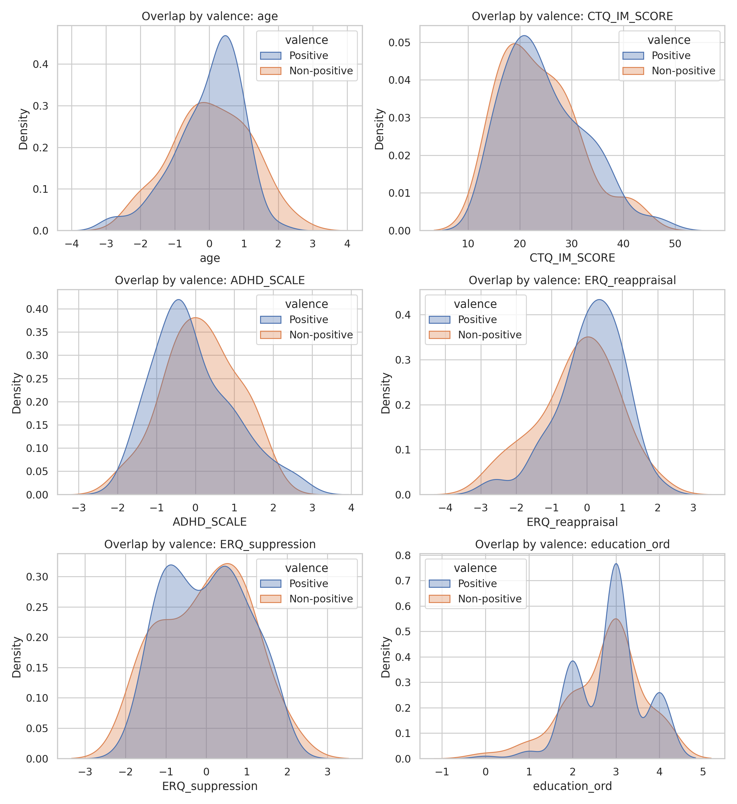
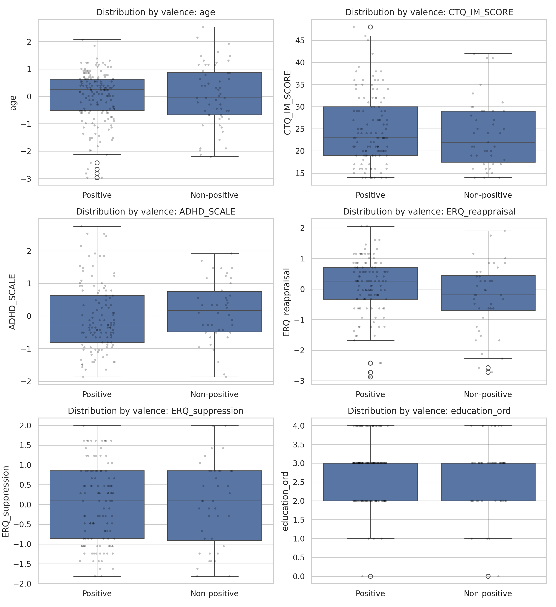
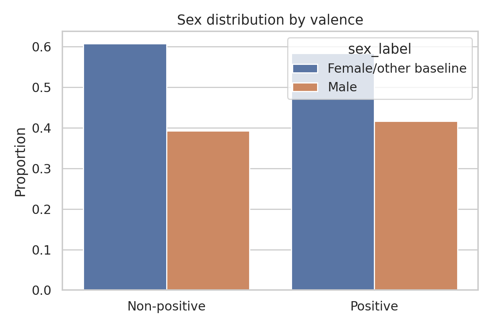

# Covariate Diagnostics Report

## Purpose

Evaluate covariate overlap and group balance between positive and non-positive valence groups before adjusted outcome modeling.

## Methodology

- Continuous and ordinal covariates: Mann-Whitney U tests.
- Categorical covariate (`sex_Male`): chi-square test.
- Analysis sample: available-case per variable (N varies by covariate and by valence group for descriptive summaries and non-parametric balance tests).
- Multiple-testing control: Benjamini-Hochberg FDR correction across balance tests.
- Visual diagnostics:
  - KDE overlap by valence
  - box/strip distributions by valence
  - sex distribution bar chart

## Overall Descriptive Statistics (Pre-Transformation)

```
       variable   n   mean    std
            age 217 60.793 13.127
   CTQ_IM_SCORE 164 24.549  7.707
     ADHD_SCALE 161 26.646 13.247
ERQ_reappraisal 156  4.706  1.120
ERQ_suppression 156  3.380  1.318
  education_ord 202  2.827  0.782
```

### Categorical Variable Summary

```
variable          top_category  top_pct   n
sex_Male Female/other baseline   58.986 217
```

## Descriptive Summary by Valence

```
       variable      valence  count   mean   std  median    min    max
            age Non-positive     56  0.054 1.124  -0.022 -2.198  2.536
            age     Positive    161 -0.019 0.959   0.245 -2.962  2.077
   CTQ_IM_SCORE Non-positive     43 23.721 7.484  22.000 14.000 42.000
   CTQ_IM_SCORE     Positive    121 24.843 7.793  23.000 14.000 48.000
     ADHD_SCALE Non-positive     42  0.149 0.928   0.178 -1.866  1.920
     ADHD_SCALE     Positive    119 -0.053 1.027  -0.276 -1.866  2.753
ERQ_reappraisal Non-positive     40 -0.267 1.117  -0.185 -2.724  1.906
ERQ_reappraisal     Positive    116  0.092 0.949   0.263 -2.873  2.055
ERQ_suppression Non-positive     40 -0.004 1.064   0.091 -1.812  1.995
ERQ_suppression     Positive    116  0.001 0.986   0.091 -1.812  1.995
  education_ord Non-positive     51  2.745 0.868   3.000  0.000  4.000
  education_ord     Positive    151  2.854 0.752   3.000  0.000  4.000
```

## Balance Tests

```
       variable               type  p_value  mean_positive  mean_non_positive  p_value_fdr p_value_fdr_reject
ERQ_reappraisal continuous/ordinal    0.058          0.092             -0.267        0.406                 No
     ADHD_SCALE continuous/ordinal    0.118         -0.053              0.149        0.412                 No
   CTQ_IM_SCORE continuous/ordinal    0.413         24.843             23.721        0.964                 No
            age continuous/ordinal    0.829         -0.019              0.054        0.976                 No
ERQ_suppression continuous/ordinal    0.976          0.001             -0.004        0.976                 No
  education_ord continuous/ordinal    0.571          2.854              2.745        0.976                 No
       sex_Male        categorical    0.883          0.416              0.393        0.976                 No
```

## Figures







## Interpretation

0 covariates were imbalanced at FDR-adjusted p<0.05 and 0 at FDR-adjusted p<0.10. Distribution overlap plots and balance tests jointly support whether adjusted analysis is plausible.