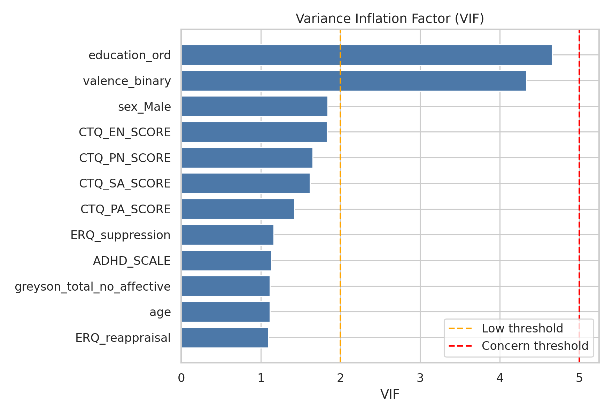
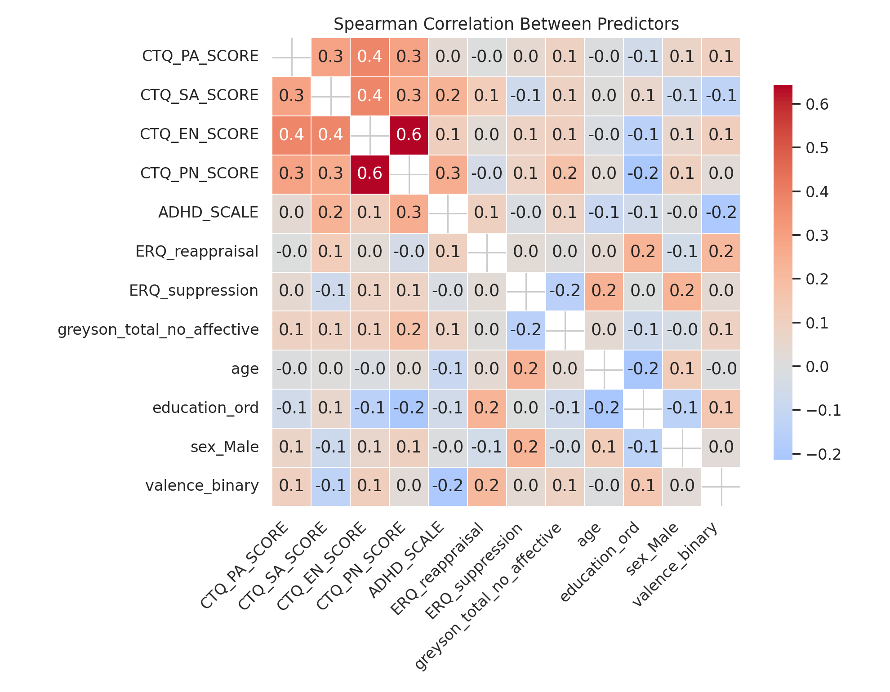
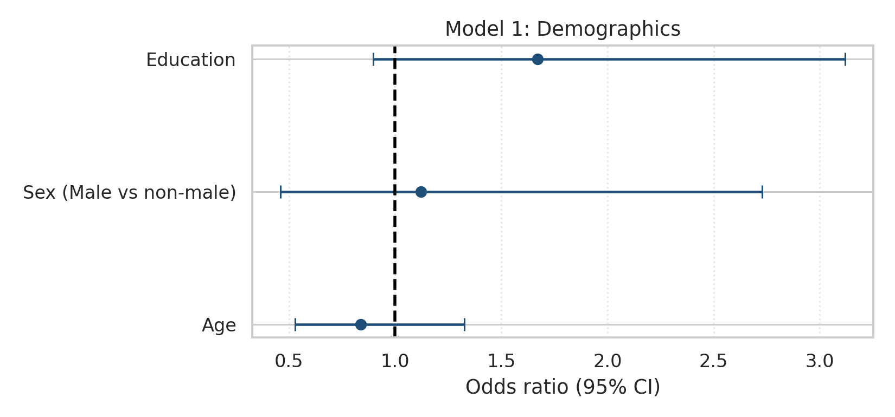
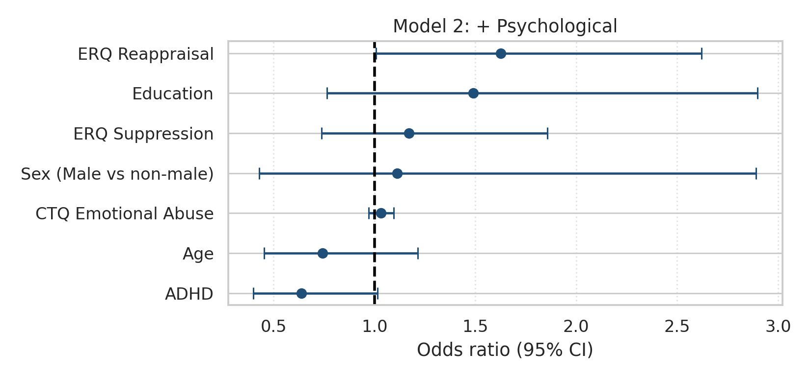
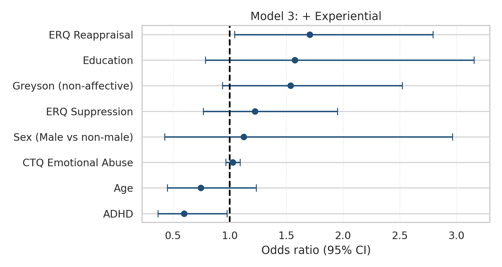
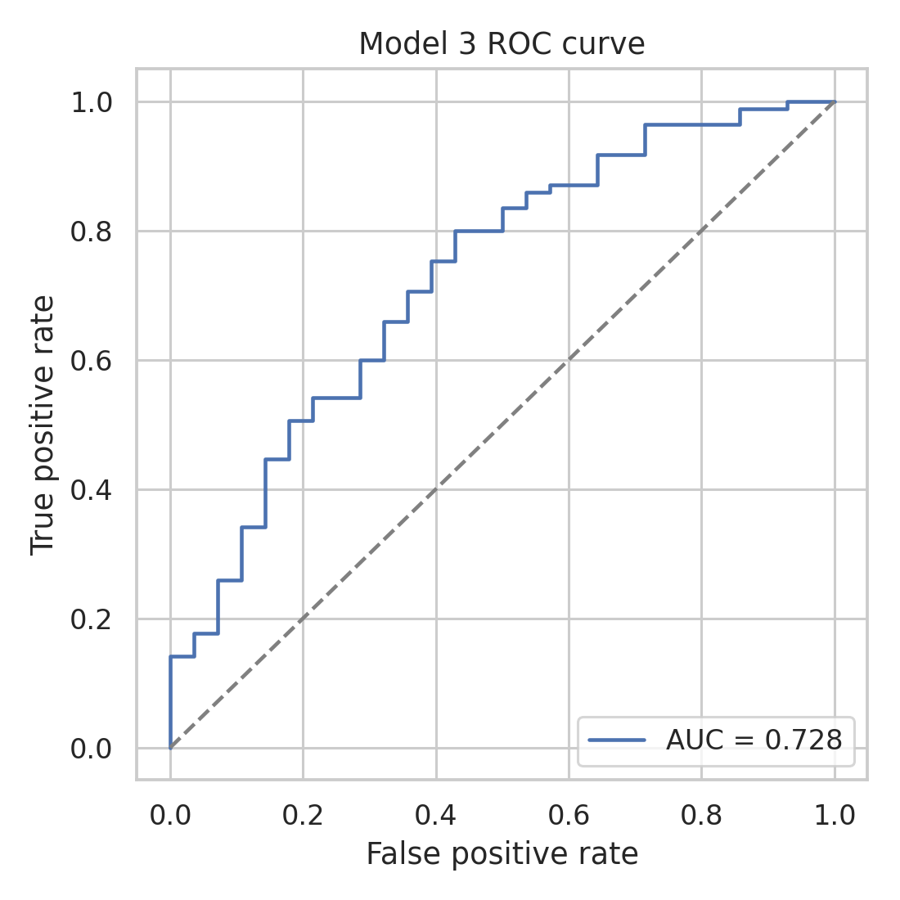
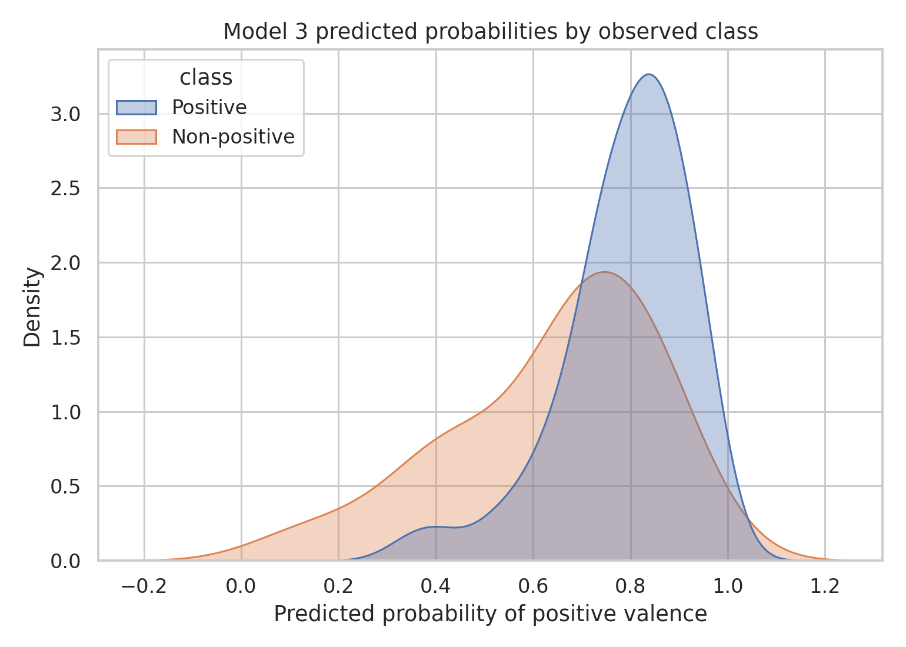

# Valence Multivariate Modeling Report

## Research Question

Do demographic, psychological, and experiential variables independently predict NDE valence?

## Valence Class Distribution

Original valence distribution:

```
 valence  n    pct
Positive 90 73.770
   Mixed 28 22.951
Negative  4  3.279
```

Binarized valence distribution used for modeling:

```
                 valence_binary  n   pct
                       Positive 90 73.77
Non-positive (Mixed + Negative) 32 26.23
```

Mixed and Negative categories are grouped into a single non-positive class to ensure adequate group size and stable estimation in multivariate models.

## Methodology

- Outcome: binary valence (`Positive = 1`, `Mixed/Negative = 0`).
- Models: hierarchical logistic regression.
  - Model 1: demographics only.
  - Model 2: demographics + psychological factors.
  - Model 3: demographics + psychological + experiential factor.
- Missing data handling: complete-case per model.
- Fit diagnostics: pseudo-R² and likelihood-ratio tests.
- Multiple-testing control: Benjamini-Hochberg FDR correction for predictor-level and model-comparison p-values.

## Model Sample Sizes

```
  model   n  pseudo_r2
Model 1 113      0.031
Model 2 113      0.104
Model 3 113      0.128
```

## Likelihood-Ratio Comparisons

```
        comparison  lr_stat  df_diff  p_value  p_value_fdr p_value_fdr_reject
Model 2 vs Model 1    9.265      4.0    0.055        0.081                 No
Model 3 vs Model 2    3.052      1.0    0.081        0.081                 No
```

## Multicollinearity Diagnostics (VIF)

VIF is computed using valence, demographic variables, CTQ subscales, ADHD, ERQ scores, and Greyson non-affective score.

```
                 predictor   vif collinearity
             education_ord 4.657     Moderate
            valence_binary 4.335     Moderate
                  sex_Male 1.839          Low
              CTQ_EN_SCORE 1.833          Low
              CTQ_PN_SCORE 1.651          Low
              CTQ_SA_SCORE 1.617          Low
              CTQ_PA_SCORE 1.423          Low
           ERQ_suppression 1.161          Low
                ADHD_SCALE 1.131          Low
greyson_total_no_affective 1.115          Low
                       age 1.113          Low
           ERQ_reappraisal 1.096          Low
```



## Predictor Correlation Heatmap

Spearman correlations among predictors are shown below to visualize dependence structure.



## Coefficients (Odds Ratios)

### Model 1

```
             predictor   coef    or  ci_low  ci_high  p_value  p_value_fdr p_value_fdr_reject
                   Age -0.178 0.837   0.529    1.326    0.449        0.673                 No
             Education  0.514 1.672   0.896    3.120    0.107        0.320                 No
Sex (Male vs non-male)  0.114 1.121   0.460    2.727    0.802        0.802                 No
```

### Model 2

```
             predictor   coef    or  ci_low  ci_high  p_value  p_value_fdr p_value_fdr_reject
                   Age -0.298 0.742   0.453    1.215    0.236        0.421                 No
             Education  0.398 1.489   0.766    2.897    0.241        0.421                 No
Sex (Male vs non-male)  0.107 1.113   0.428    2.892    0.826        0.826                 No
   CTQ Emotional Abuse  0.032 1.032   0.972    1.096    0.303        0.424                 No
                  ADHD -0.448 0.639   0.401    1.016    0.058        0.204                 No
       ERQ Reappraisal  0.486 1.626   1.008    2.621    0.046        0.204                 No
       ERQ Suppression  0.158 1.171   0.739    1.857    0.501        0.585                 No
```

### Model 3

```
              predictor   coef    or  ci_low  ci_high  p_value  p_value_fdr p_value_fdr_reject
                    Age -0.295 0.745   0.450    1.232    0.251        0.402                 No
              Education  0.454 1.575   0.786    3.156    0.200        0.401                 No
 Sex (Male vs non-male)  0.117 1.124   0.426    2.964    0.813        0.813                 No
    CTQ Emotional Abuse  0.026 1.026   0.964    1.092    0.419        0.479                 No
                   ADHD -0.514 0.598   0.367    0.975    0.039        0.157                 No
        ERQ Reappraisal  0.534 1.706   1.042    2.794    0.034        0.157                 No
        ERQ Suppression  0.200 1.222   0.766    1.948    0.400        0.479                 No
Greyson (non-affective)  0.429 1.536   0.936    2.521    0.090        0.239                 No
```

## Figures

### Model 1 Odds-Ratio Forest



### Model 2 Odds-Ratio Forest



### Model 3 Odds-Ratio Forest



### Model 3 ROC



### Model 3 Predicted Probabilities



## Interpretation

Model fit improved from pseudo-R²=0.031 (demographics only) to pseudo-R²=0.128 (full model). LR tests indicated FDR-adjusted p=0.081 for Model 2 vs 1 and p=0.081 for Model 3 vs 2. Model 3 ROC AUC=0.728.

## Limitations

- Complete-case analysis can reduce effective sample size.
- Logistic model estimates are association-based and do not imply causality.