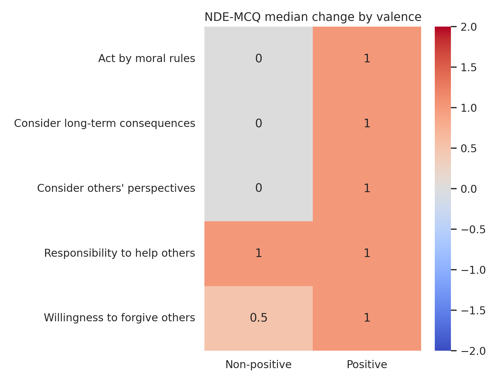
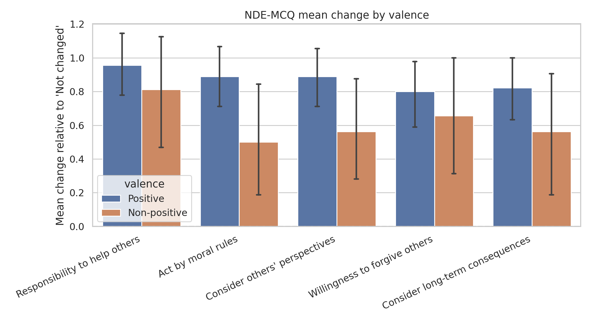
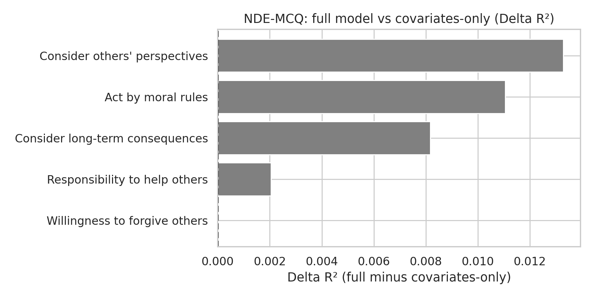

# Post-NDE Effects Report

## Scope

This report summarizes post-NDE effects for NDE-MCQ.

## Methodology

- Global change versus zero: Wilcoxon signed-rank test.
- Positive vs non-positive valence comparison: Mann-Whitney U test.
- Multiple-testing control: Benjamini-Hochberg FDR correction within each hypothesis family.
- Adjusted OLS models:
  - Full model: `outcome ~ valence + covariates`
  - Covariates-only model: `outcome ~ covariates`
- Model comparison: R², AIC, BIC, and delta metrics.

## Global Change

```
                           item  median  mean  p_value   n  p_value_fdr p_value_fdr_reject
  Responsibility to help others     1.0 0.918      0.0 122          0.0                Yes
  Consider others' perspectives     1.0 0.803      0.0 122          0.0                Yes
             Act by moral rules     1.0 0.787      0.0 122          0.0                Yes
Consider long-term consequences     1.0 0.754      0.0 122          0.0                Yes
  Willingness to forgive others     1.0 0.762      0.0 122          0.0                Yes
```

## Differences by Valence

```
                           item  mean_positive  mean_non_positive  median_positive  median_non_positive  p_value  n_positive  n_non_positive  p_value_fdr p_value_fdr_reject
             Act by moral rules          0.889              0.500              1.0                  0.0    0.071          90              32        0.216                 No
  Consider others' perspectives          0.889              0.562              1.0                  0.0    0.087          90              32        0.216                 No
Consider long-term consequences          0.822              0.562              1.0                  0.0    0.256          90              32        0.426                 No
  Willingness to forgive others          0.800              0.656              1.0                  0.5    0.368          90              32        0.460                 No
  Responsibility to help others          0.956              0.812              1.0                  1.0    0.536          90              32        0.536                 No
```

## Adjusted Models (Full)

```
                        outcome   N  baseline  baseline_ci_low  baseline_ci_high  baseline_p  baseline_p_fdr  valence_beta  valence_ci_low  valence_ci_high  valence_p  valence_p_fdr    r2     aic     bic
             Act by moral rules 113     0.533            0.149             0.918       0.007           0.009         0.248          -0.170            0.667      0.243          0.567 0.176 306.173 333.447
  Consider others' perspectives 113     0.597            0.255             0.939       0.001           0.002         0.237          -0.135            0.610      0.209          0.567 0.144 279.720 306.994
Consider long-term consequences 113     0.514            0.113             0.914       0.012           0.012         0.211          -0.225            0.646      0.340          0.567 0.084 315.291 342.565
  Responsibility to help others 113     1.019            0.653             1.385       0.000           0.000        -0.098          -0.496            0.300      0.627          0.784 0.112 294.832 322.106
  Willingness to forgive others 113     0.695            0.271             1.118       0.002           0.003        -0.003          -0.464            0.457      0.988          0.988 0.113 327.676 354.950
```

## Adjusted Models (Covariates-Only)

```
                        outcome   N  baseline  baseline_ci_low  baseline_ci_high  baseline_p  baseline_p_fdr    r2     aic     bic
             Act by moral rules 113     0.718            0.493             0.944         0.0             0.0 0.165 305.679 330.225
Consider long-term consequences 113     0.671            0.437             0.905         0.0             0.0 0.076 314.294 338.841
  Consider others' perspectives 113     0.774            0.573             0.975         0.0             0.0 0.131 279.462 304.008
  Responsibility to help others 113     0.946            0.733             1.159         0.0             0.0 0.110 293.092 317.639
  Willingness to forgive others 113     0.692            0.446             0.938         0.0             0.0 0.113 325.676 350.222
```

## Full vs Covariates-Only Comparison

```
                        outcome   N  valence_beta  valence_ci_low  valence_ci_high  valence_p  valence_p_fdr valence_fdr_reject  R2_full  R2_cov_only  delta_R2  delta_AIC  delta_BIC valence_adds_signal
             Act by moral rules 113         0.248          -0.170            0.667      0.243          0.567                 No    0.176        0.165     0.011      0.494      3.221                  No
  Consider others' perspectives 113         0.237          -0.135            0.610      0.209          0.567                 No    0.144        0.131     0.013      0.259      2.986                  No
Consider long-term consequences 113         0.211          -0.225            0.646      0.340          0.567                 No    0.084        0.076     0.008      0.997      3.724                  No
  Responsibility to help others 113        -0.098          -0.496            0.300      0.627          0.784                 No    0.112        0.110     0.002      1.739      4.467                  No
  Willingness to forgive others 113        -0.003          -0.464            0.457      0.988          0.988                 No    0.113        0.113     0.000      2.000      4.727                  No
```

## Figures









## Interpretation

0 outcomes showed evidence that valence adds explanatory value beyond covariates after FDR correction. Interpretation is based on FDR-adjusted valence p-values in the full model and model-fit deltas between full and covariates-only specifications.