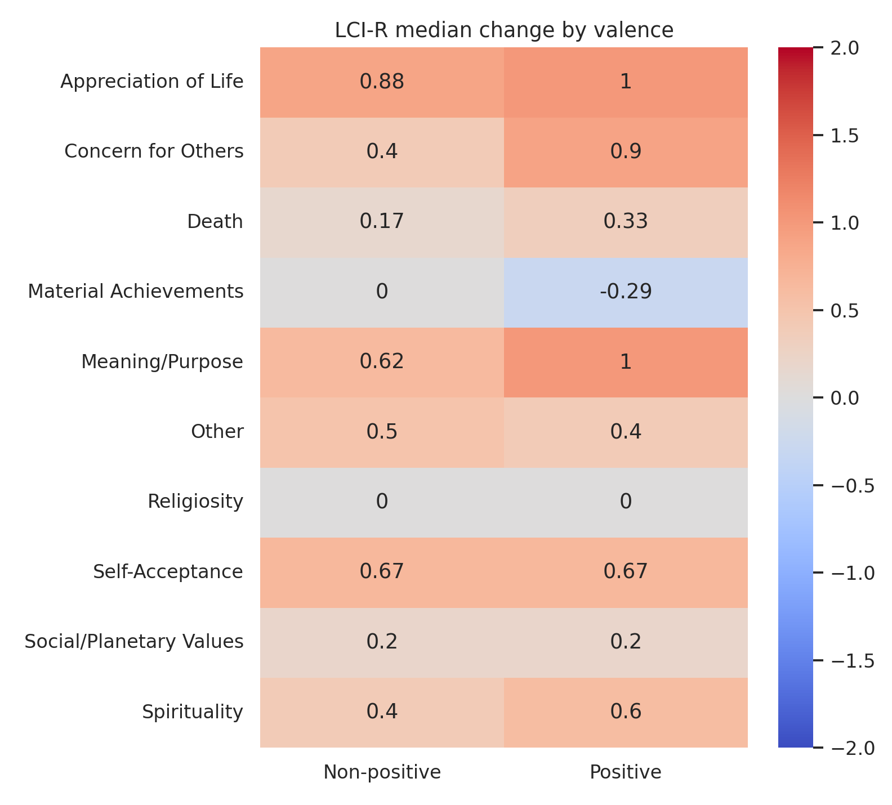
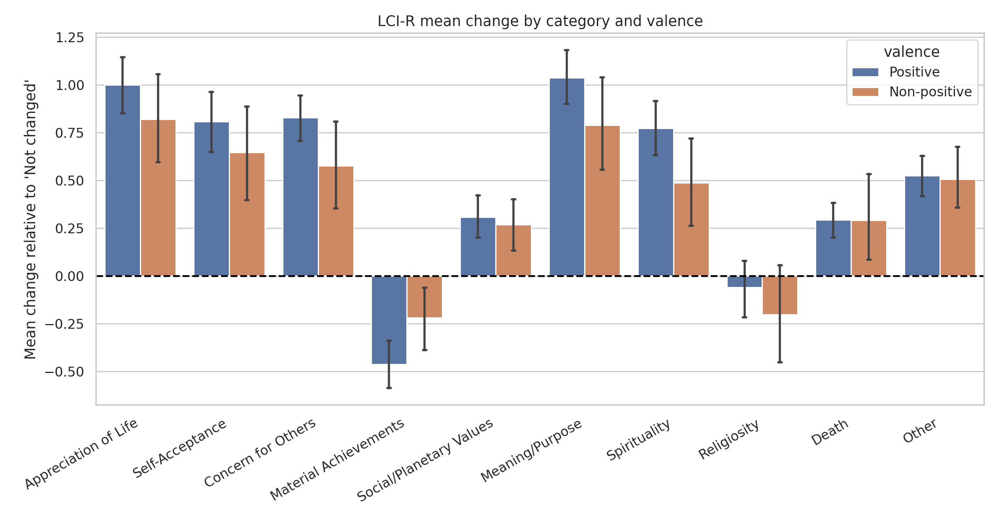
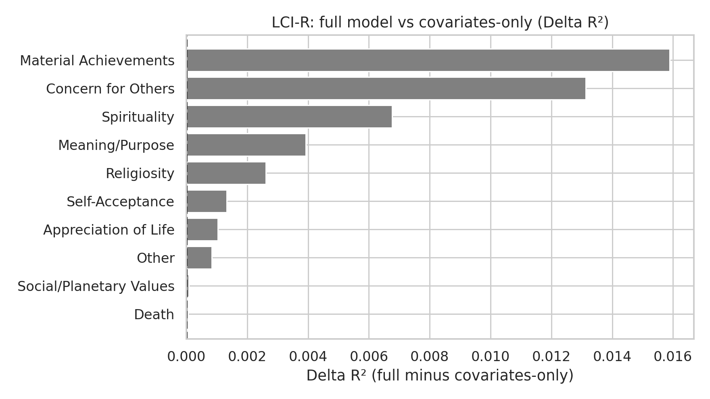

# Post-NDE Effects Report

## Scope

This report summarizes post-NDE effects for LCI-R.

## Methodology

- Global change versus zero: Wilcoxon signed-rank test.
- Positive vs non-positive valence comparison: Mann-Whitney U test.
- Multiple-testing control: Benjamini-Hochberg FDR correction within each hypothesis family.
- Adjusted OLS models:
  - Full model: `outcome ~ valence + covariates`
  - Covariates-only model: `outcome ~ covariates`
- Model comparison: R², AIC, BIC, and delta metrics.

## Global Change

```
               category  median   mean  p_value   n  p_value_fdr p_value_fdr_reject
     Concern for Others   0.800  0.761    0.000 122        0.000                Yes
        Meaning/Purpose   1.000  0.971    0.000 122        0.000                Yes
   Appreciation of Life   1.000  0.953    0.000 122        0.000                Yes
                  Other   0.400  0.520    0.000 122        0.000                Yes
        Self-Acceptance   0.667  0.765    0.000 122        0.000                Yes
           Spirituality   0.600  0.697    0.000 122        0.000                Yes
  Material Achievements  -0.143 -0.398    0.000 122        0.000                Yes
Social/Planetary Values   0.200  0.297    0.000 122        0.000                Yes
                  Death   0.333  0.292    0.000 122        0.000                Yes
            Religiosity   0.000 -0.098    0.261 122        0.261                 No
```

## Differences by Valence

```
               category  mean_positive  mean_non_positive  median_positive  median_non_positive  p_value  n_positive  n_non_positive  p_value_fdr p_value_fdr_reject
  Material Achievements         -0.462             -0.219           -0.286                0.000    0.053          90              32        0.164                 No
     Concern for Others          0.828              0.575            0.900                0.400    0.052          90              32        0.164                 No
           Spirituality          0.771              0.488            0.600                0.400    0.046          90              32        0.164                 No
        Meaning/Purpose          1.036              0.789            1.000                0.625    0.065          90              32        0.164                 No
   Appreciation of Life          1.000              0.820            1.000                0.875    0.252          90              32        0.504                 No
        Self-Acceptance          0.807              0.646            0.667                0.667    0.393          90              32        0.560                 No
            Religiosity         -0.061             -0.203            0.000                0.000    0.448          90              32        0.560                 No
                  Death          0.293              0.292            0.333                0.167    0.377          90              32        0.560                 No
Social/Planetary Values          0.307              0.269            0.200                0.200    0.792          90              32        0.880                 No
                  Other          0.524              0.506            0.400                0.500    0.958          90              32        0.958                 No
```

## Adjusted Models (Full)

```
                outcome   N  baseline  baseline_ci_low  baseline_ci_high  baseline_p  baseline_p_fdr  valence_beta  valence_ci_low  valence_ci_high  valence_p  valence_p_fdr    r2     aic     bic
   Appreciation of Life 113     0.946            0.662             1.231       0.000           0.000         0.057          -0.252            0.367      0.713          0.922 0.214 238.051 265.324
        Self-Acceptance 113     0.760            0.462             1.057       0.000           0.000         0.069          -0.254            0.393      0.672          0.922 0.240 247.972 275.246
     Concern for Others 113     0.638            0.391             0.884       0.000           0.000         0.179          -0.089            0.447      0.187          0.922 0.232 205.367 232.641
  Material Achievements 113    -0.236           -0.473             0.001       0.051           0.056        -0.186          -0.444            0.072      0.156          0.922 0.199 196.660 223.934
        Meaning/Purpose 113     1.001            0.737             1.265       0.000           0.000         0.108          -0.180            0.396      0.458          0.922 0.271 221.464 248.738
           Spirituality 113     0.700            0.414             0.987       0.000           0.000         0.150          -0.162            0.462      0.344          0.922 0.230 239.821 267.095
            Religiosity 113    -0.035           -0.350             0.280       0.828           0.828        -0.092          -0.435            0.251      0.595          0.922 0.054 261.132 288.406
                  Other 113     0.657            0.462             0.852       0.000           0.000        -0.036          -0.248            0.176      0.738          0.922 0.241 152.715 179.989
Social/Planetary Values 113     0.325            0.112             0.539       0.003           0.004        -0.010          -0.243            0.222      0.929          0.934 0.067 172.922 200.195
                  Death 113     0.345            0.134             0.556       0.002           0.002        -0.010          -0.240            0.220      0.934          0.934 0.156 170.770 198.044
```

## Adjusted Models (Covariates-Only)

```
                outcome   N  baseline  baseline_ci_low  baseline_ci_high  baseline_p  baseline_p_fdr    r2     aic     bic
   Appreciation of Life 113     0.989            0.823             1.155       0.000           0.000 0.213 236.199 260.746
     Concern for Others 113     0.771            0.627             0.916       0.000           0.000 0.219 205.283 229.830
                  Death 113     0.338            0.215             0.461       0.000           0.000 0.156 168.778 193.325
  Material Achievements 113    -0.375           -0.514            -0.236       0.000           0.000 0.183 196.880 221.427
        Meaning/Purpose 113     1.082            0.927             1.236       0.000           0.000 0.267 220.070 244.617
                  Other 113     0.630            0.517             0.744       0.000           0.000 0.240 150.838 175.385
            Religiosity 113    -0.103           -0.287             0.080       0.267           0.267 0.052 259.443 283.989
        Self-Acceptance 113     0.811            0.638             0.984       0.000           0.000 0.238 246.169 270.716
Social/Planetary Values 113     0.318            0.194             0.442       0.000           0.000 0.067 170.930 195.477
           Spirituality 113     0.812            0.644             0.980       0.000           0.000 0.223 238.809 263.355
```

## Full vs Covariates-Only Comparison

```
                outcome   N  valence_beta  valence_ci_low  valence_ci_high  valence_p  valence_p_fdr valence_fdr_reject  R2_full  R2_cov_only  delta_R2  delta_AIC  delta_BIC valence_adds_signal
   Appreciation of Life 113         0.057          -0.252            0.367      0.713          0.922                 No    0.214        0.213     0.001      1.851      4.579                  No
        Self-Acceptance 113         0.069          -0.254            0.393      0.672          0.922                 No    0.240        0.238     0.001      1.803      4.530                  No
     Concern for Others 113         0.179          -0.089            0.447      0.187          0.922                 No    0.232        0.219     0.013      0.084      2.811                  No
  Material Achievements 113        -0.186          -0.444            0.072      0.156          0.922                 No    0.199        0.183     0.016     -0.221      2.507                  No
        Meaning/Purpose 113         0.108          -0.180            0.396      0.458          0.922                 No    0.271        0.267     0.004      1.393      4.121                  No
           Spirituality 113         0.150          -0.162            0.462      0.344          0.922                 No    0.230        0.223     0.007      1.012      3.739                  No
            Religiosity 113        -0.092          -0.435            0.251      0.595          0.922                 No    0.054        0.052     0.003      1.689      4.416                  No
                  Other 113        -0.036          -0.248            0.176      0.738          0.922                 No    0.241        0.240     0.001      1.876      4.604                  No
Social/Planetary Values 113        -0.010          -0.243            0.222      0.929          0.934                 No    0.067        0.067     0.000      1.991      4.719                  No
                  Death 113        -0.010          -0.240            0.220      0.934          0.934                 No    0.156        0.156     0.000      1.992      4.720                  No
```

## Figures









## Interpretation

0 outcomes showed evidence that valence adds explanatory value beyond covariates after FDR correction. Interpretation is based on FDR-adjusted valence p-values in the full model and model-fit deltas between full and covariates-only specifications.