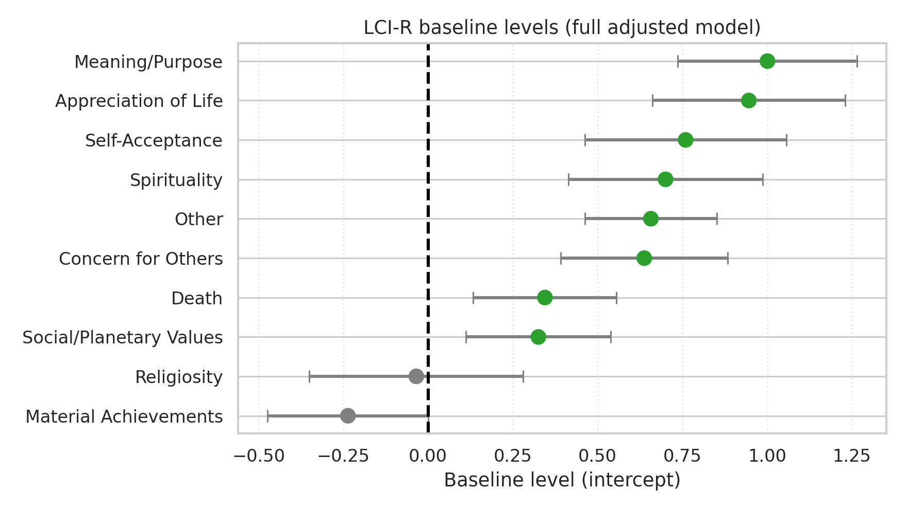
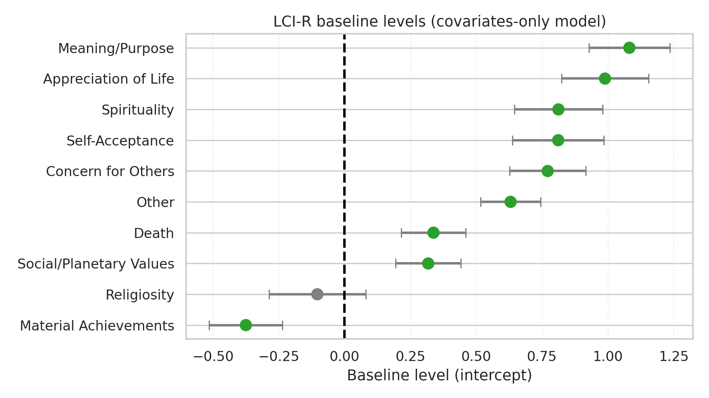
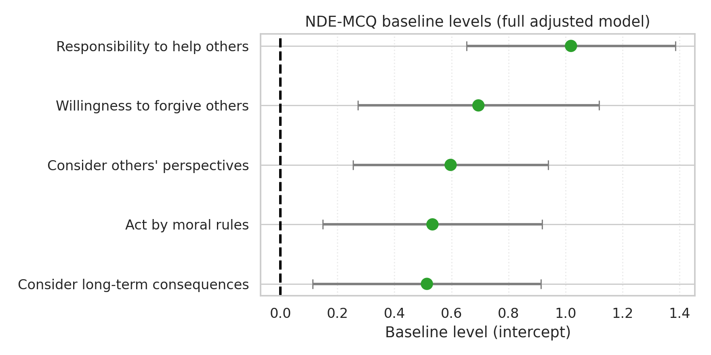
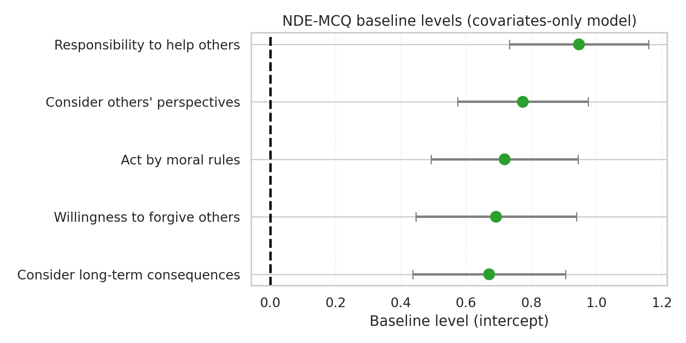

# Adjusted Models Comparison

## LCI-R: Full vs Covariates-Only

```
                outcome   N  valence_beta  valence_ci_low  valence_ci_high  valence_p  valence_p_fdr valence_fdr_reject  R2_full  R2_cov_only  delta_R2  delta_AIC  delta_BIC valence_adds_signal
   Appreciation of Life 113         0.057          -0.252            0.367      0.713          0.922                 No    0.214        0.213     0.001      1.851      4.579                  No
        Self-Acceptance 113         0.069          -0.254            0.393      0.672          0.922                 No    0.240        0.238     0.001      1.803      4.530                  No
     Concern for Others 113         0.179          -0.089            0.447      0.187          0.922                 No    0.232        0.219     0.013      0.084      2.811                  No
  Material Achievements 113        -0.186          -0.444            0.072      0.156          0.922                 No    0.199        0.183     0.016     -0.221      2.507                  No
        Meaning/Purpose 113         0.108          -0.180            0.396      0.458          0.922                 No    0.271        0.267     0.004      1.393      4.121                  No
           Spirituality 113         0.150          -0.162            0.462      0.344          0.922                 No    0.230        0.223     0.007      1.012      3.739                  No
            Religiosity 113        -0.092          -0.435            0.251      0.595          0.922                 No    0.054        0.052     0.003      1.689      4.416                  No
                  Other 113        -0.036          -0.248            0.176      0.738          0.922                 No    0.241        0.240     0.001      1.876      4.604                  No
Social/Planetary Values 113        -0.010          -0.243            0.222      0.929          0.934                 No    0.067        0.067     0.000      1.991      4.719                  No
                  Death 113        -0.010          -0.240            0.220      0.934          0.934                 No    0.156        0.156     0.000      1.992      4.720                  No
```






## NDE-MCQ: Full vs Covariates-Only

```
                        outcome   N  valence_beta  valence_ci_low  valence_ci_high  valence_p  valence_p_fdr valence_fdr_reject  R2_full  R2_cov_only  delta_R2  delta_AIC  delta_BIC valence_adds_signal
             Act by moral rules 113         0.248          -0.170            0.667      0.243          0.567                 No    0.176        0.165     0.011      0.494      3.221                  No
  Consider others' perspectives 113         0.237          -0.135            0.610      0.209          0.567                 No    0.144        0.131     0.013      0.259      2.986                  No
Consider long-term consequences 113         0.211          -0.225            0.646      0.340          0.567                 No    0.084        0.076     0.008      0.997      3.724                  No
  Responsibility to help others 113        -0.098          -0.496            0.300      0.627          0.784                 No    0.112        0.110     0.002      1.739      4.467                  No
  Willingness to forgive others 113        -0.003          -0.464            0.457      0.988          0.988                 No    0.113        0.113     0.000      2.000      4.727                  No
```





