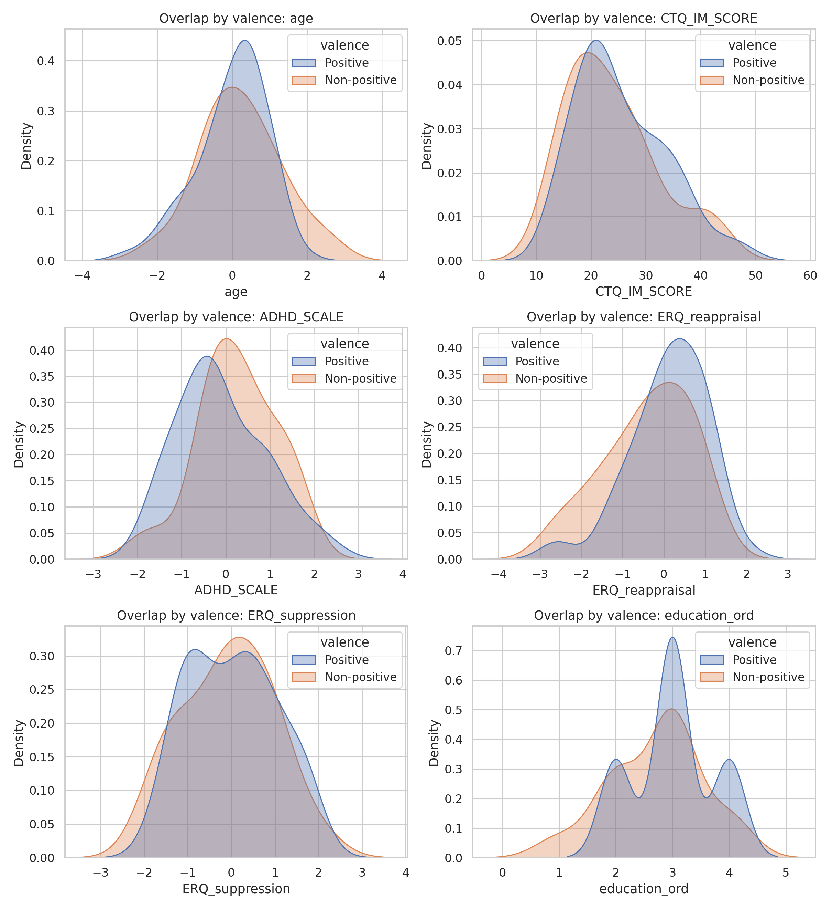
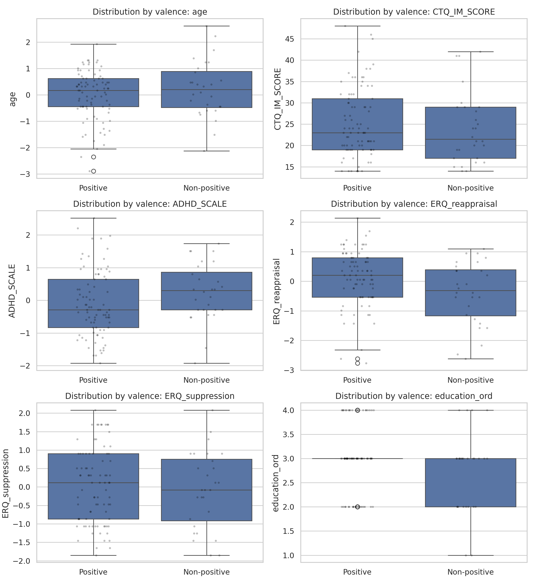
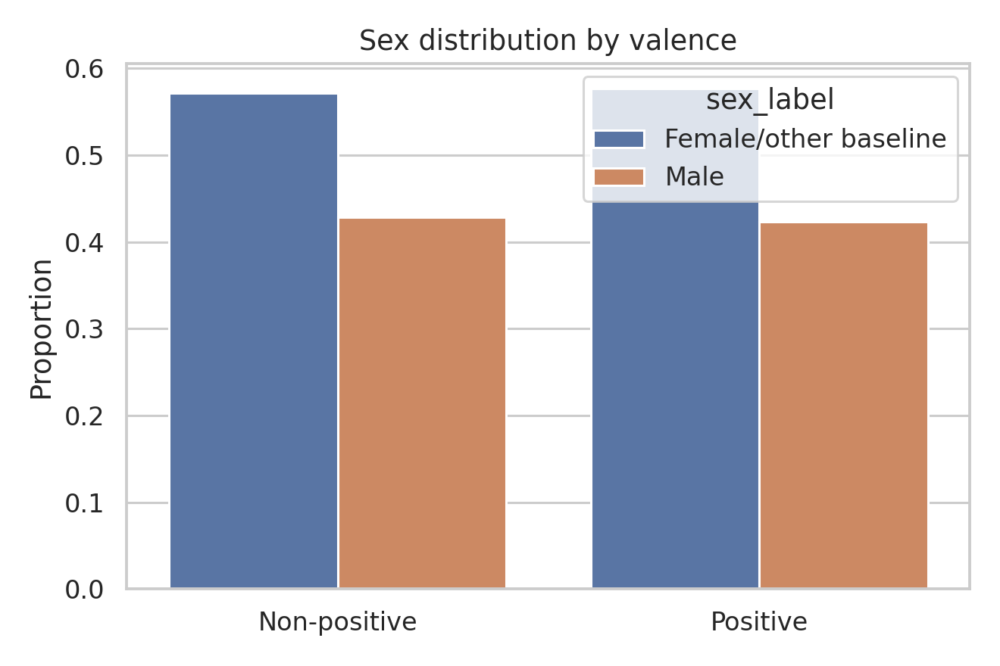

# Covariate Diagnostics Report

## Purpose

Evaluate covariate overlap and group balance between positive and non-positive valence groups before adjusted outcome modeling.

## Methodology

- Continuous and ordinal covariates: Mann-Whitney U tests.
- Categorical covariate (`sex_Male`): chi-square test.
- Analysis sample: complete-case intersection across `valence_binary`, `sex_Male`, `age`, `CTQ_IM_SCORE`, `ADHD_SCALE`, `ERQ_reappraisal`, `ERQ_suppression`, and `education_ord`.
- Multiple-testing control: Benjamini-Hochberg FDR correction across balance tests.
- Visual diagnostics:
  - KDE overlap by valence
  - box/strip distributions by valence
  - sex distribution bar chart

## Overall Descriptive Statistics (Pre-Transformation)

```
       variable   n   mean    std
            age 113 60.434 12.773
   CTQ_IM_SCORE 113 25.053  8.197
     ADHD_SCALE 113 26.504 12.651
ERQ_reappraisal 113  4.602  1.113
ERQ_suppression 113  3.352  1.291
  education_ord 113  2.929  0.728
```

### Categorical Variable Summary

```
variable          top_category  top_pct   n
sex_Male Female/other baseline   57.522 113
```

## Descriptive Summary by Valence

```
       variable      valence  count   mean   std  median    min    max
            age Non-positive     28  0.222 1.076   0.206 -2.124  2.613
            age     Positive     85 -0.009 0.940   0.168 -2.888  1.925
   CTQ_IM_SCORE Non-positive     28 23.893 8.270  21.500 14.000 42.000
   CTQ_IM_SCORE     Positive     85 25.435 8.186  23.000 14.000 48.000
     ADHD_SCALE Non-positive     28  0.248 0.885   0.298 -1.924  1.740
     ADHD_SCALE     Positive     85 -0.100 1.008  -0.287 -1.924  2.520
ERQ_reappraisal Non-positive     28 -0.395 1.060  -0.315 -2.619  1.096
ERQ_reappraisal     Positive     85  0.128 0.939   0.205 -2.767  2.136
ERQ_suppression Non-positive     28 -0.074 1.042  -0.081 -1.850  2.082
ERQ_suppression     Positive     85  0.024 1.011   0.116 -1.850  2.082
  education_ord Non-positive     28  2.714 0.810   3.000  1.000  4.000
  education_ord     Positive     85  3.000 0.690   3.000  2.000  4.000
```

## Balance Tests

```
       variable               type  p_value  mean_positive  mean_non_positive  p_value_fdr p_value_fdr_reject
ERQ_reappraisal continuous/ordinal    0.026          0.128             -0.395        0.168                 No
     ADHD_SCALE continuous/ordinal    0.048         -0.100              0.248        0.168                 No
  education_ord continuous/ordinal    0.118          3.000              2.714        0.275                 No
   CTQ_IM_SCORE continuous/ordinal    0.334         25.435             23.893        0.585                 No
            age continuous/ordinal    0.529         -0.009              0.222        0.741                 No
ERQ_suppression continuous/ordinal    0.687          0.024             -0.074        0.801                 No
       sex_Male        categorical    1.000          0.424              0.429        1.000                 No
```

## Figures







## Interpretation

0 covariates were imbalanced at FDR-adjusted p<0.05 and 0 at FDR-adjusted p<0.10. Distribution overlap plots and balance tests jointly support whether adjusted analysis is plausible.